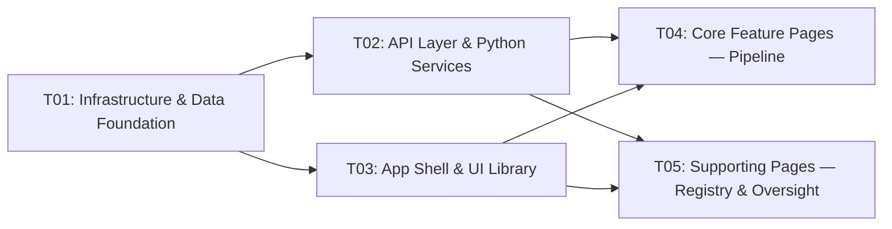

# GHARIBO AI LAB — System Architecture & Task Decomposition

| Field | Value |
|-------|-------|
| **Document Owner** | Architecture (GHARIBO AI LAB) |
| **Type** | Architecture |
| **Status** | Frozen |
| **Version** | 1.1.1 |
| **Last Updated** | 2026-09-14 |
| **Project Name** | `gharibo_ai_lab` |
| **Based On** | `docs/PRD.md` (v1.0.0) |
| **Extended By** | `docs/ARCHITECTURE_MILESTONE_2.md` (v1.0.0) — M2 zero-cost training pipeline (ADR-0011..0014) |

> **Baseline freeze — 2026-09-14.** This document is the frozen architecture baseline for
> Milestone 1 (the vertical slice). It reflects what was actually built, not what was planned.
> From this point, changing it requires an ADR and a version bump per
> `docs/DOCUMENTATION_GOVERNANCE.md` §5. The countable claims in §2.7 are machine-checked by
> `npm run docs:validate` — update that block whenever the code changes.

> **v1.1.0 — Milestone 2 extension (2026-09-14).** Milestone 2 is **additive**: it introduces the
> provider-neutral `TrainingWorker` abstraction, the canonical Training Package, content-addressed
> dataset versions, and the zero-cost artifact policy. The full incremental design lives in
> `docs/ARCHITECTURE_MILESTONE_2.md`; the decisions are recorded in ADR-0011 (worker abstraction),
> ADR-0012 (training package), ADR-0013 (dataset versions), and ADR-0014 (zero-cost artifacts).
> Nothing in this M1 baseline is invalidated — the M1 tables, routes, and pages remain the
> contract, and M2 extends them.

---

## 1. Implementation Plan & Framework Selection

### 1.1 Final Tech Stack

| Layer | Technology | Version | Rationale |
|-------|-----------|---------|-----------|
| **Monorepo** | npm workspaces | npm 10.9+ | Native, zero new tooling; works on Windows/Node 22 |
| **Frontend + API** | Next.js (App Router) | 14.2.x | Full-stack in one app; API Routes = the `/apps/api` layer; SSR + RSC + file-based routing for 10 sections |
| **Language** | TypeScript | 5.5.x | Shared types across web + packages/shared; type safety end-to-end |
| **UI Primitives** | shadcn/ui (Radix UI + CVA) | latest | Headless, accessible, themeable; copy-in components (no lock-in); premium minimal aesthetic per PRD §9.3 |
| **Styling** | Tailwind CSS | 3.4.x | Utility-first; dark mode via `class` strategy; pairs with shadcn/ui |
| **Database** | SQLite | (bundled) | P0 requires persistence across restarts + switchable to PostgreSQL; file-based, zero ops |
| **DB Client** | `better-sqlite3` | 11.x | Synchronous, fast, no ORM lock-in; enables a clean Repository Pattern so PostgreSQL can be swapped later (P2-04) by swapping the repository implementation |
| **Python Services** | FastAPI + Uvicorn | 0.115.x / 0.30.x | `/services/trainer`, `/services/inference`, `/services/research`; FastAPI is async, typed (Pydantic), and the pre-flight check MUST run real Python ML inspections |
| **Python ML deps** | torch, transformers, peft, trl | latest stable | Pre-flight (P0-12) imports these to detect presence/absence; actual training is P1-01 |
| **Validation (TS)** | Zod | 3.x | Runtime schema validation for API request bodies; mirrors the data-factory validation engine |
| **ID generation** | `crypto.randomUUID()` | Node built-in | No extra dep; collision-safe |

### 1.2 Architecture Pattern

- **Frontend**: React Server Components (RSC) for data-heavy pages (lists, tables) + Client Components for interactivity (chat, forms, theme toggle). Data fetched in RSC via direct repository calls (no separate client fetcher needed for first paint).
- **Backend**: Next.js Route Handlers (`app/api/*/route.ts`) as a thin controller layer → **Repository Pattern** (`lib/db/repositories/*`) for data access → **Service Layer** (`lib/providers/*`, `lib/validation/*`, `lib/preflight.ts`, `lib/jsonl.ts`) for business logic.
- **Provider Abstraction**: `ModelProvider` interface with four implementations (openai-compatible, ollama, vllm, huggingface). Configured at runtime from DB, never hard-coded.
- **Cross-service**: Next.js API calls Python FastAPI services over HTTP localhost. The **pre-flight check** (P0-12) is the critical cross-service call — Next.js `/api/preflight` proxies to `services/trainer /preflight`, which runs real Python ML environment inspections.
- **Secrets**: API keys referenced by name only in DB (`api_key_ref`); raw values live in `.env.local` / OS env. `lib/secrets.ts` resolves a ref → env lookup at call time. Never logged, never returned by API.

### 1.3 Database Access Pattern

```
Next.js Route Handler (controller)
        ↓ calls
Repository (lib/db/repositories/*)  ← interface: row<->domain object mapping
        ↓ uses
better-sqlite3 connection (lib/db/index.ts)  ← singleton, WAL mode, persists to apps/web/data/gharibo.db
```

- The repository layer maps SQLite rows (JSON columns for arrays/objects) ↔ TypeScript domain objects from `@gharibo/shared`.
- To swap to PostgreSQL later: implement the same repository interfaces against a `pg` client — no controller/UI changes.

---

## 2. File List (with relative paths)

> Paths are relative to the repository root. Every file needed for the vertical slice is listed.

### 2.0 Root Config & Monorepo Skeleton

| File | Purpose |
|------|---------|
| `package.json` | Root workspace config (`"workspaces": ["apps/web", "packages/shared"]`), scripts (`dev`, `build`, `lint`, `typecheck`, `dev:services`) |
| `tsconfig.base.json` | Shared TS compiler options (strict, `target ES2022`, `moduleResolution bundler`) |
| `.gitignore` | Excludes secrets and generated/runtime state from a **public** repository: `.env` / `.env.*` (while keeping `!.env.example` and `!.env.local.example`), `node_modules/`, build output (`.next/`, `dist/`, `build/`), Python caches and virtualenvs, SQLite databases (`*.db`, `*.db-wal`, `*.db-shm`, `apps/web/data/`), pipeline data (`data/{raw,processed,datasets,exports}/*`, structure preserved with `.gitkeep`), model artifacts (`models/{checkpoints,adapters,weights,registry}/*`), logs, and machine-local tooling state (`.workbuddy-ai/`, `.vscode/`, `.idea/`) |
| `.gitattributes` | Normalises text to LF (`* text=auto eol=lf`) and marks binary artifact types so they are never diffed or normalised |
| `.env.example` | Documents `DATABASE_PATH`, `TRAINER_URL`, `INFERENCE_URL`, `RESEARCH_URL`, `CORS_ALLOWED_ORIGINS`, and states that provider API keys are referenced by name only |
| `README.md` | Quickstart: install, migrate, run web + services |
| `data/.gitkeep` | Keeps the data tree in git |
| `data/datasets/.gitkeep` | Exported dataset JSONL lands here |
| `data/raw/.gitkeep` | Raw imported JSONL |
| `data/processed/.gitkeep` | Normalized data |
| `data/exports/.gitkeep` | Dataset exports |
| `models/.gitkeep` | Model artifacts root |
| `models/adapters/.gitkeep` | LoRA adapter outputs |
| `models/checkpoints/.gitkeep` | Full checkpoints |
| `models/registry/.gitkeep` | Registry manifests |

### 2.1 `packages/shared` — Shared TypeScript Types

| File | Purpose |
|------|---------|
| `packages/shared/package.json` | Workspace package `@gharibo/shared`, exports `./src/index.ts` |
| `packages/shared/tsconfig.json` | Extends root base config |
| `packages/shared/src/index.ts` | Barrel re-export |
| `packages/shared/src/types/api.ts` | `ApiResponse<T>`, `Paginated<T>`, error envelope |
| `packages/shared/src/types/provider.ts` | `ProviderConfig`, `ProviderType` enum, `Message`, `ChatOptions`, `ChatChunk` |
| `packages/shared/src/types/conversation.ts` | `Conversation`, `ConversationMessage`, `QualitySignal` |
| `packages/shared/src/types/training-example.ts` | `TrainingExample`, `ApprovalState` enum |
| `packages/shared/src/types/data-factory.ts` | `DataFactoryRecord`, `VerificationStatus` enum, `ValidationResult`, `ValidationStatus` |
| `packages/shared/src/types/dataset.ts` | `Dataset`, `DatasetRecord` |
| `packages/shared/src/types/training-run.ts` | `TrainingRun`, `TrainingMethod` enum, `RunStatus` enum |
| `packages/shared/src/types/model-registry.ts` | `ModelRegistryEntry`, `ModelStatus` enum |
| `packages/shared/src/types/research.ts` | `ResearchRecord`, `ResearchEntity` types, schema enum |
| `packages/shared/src/types/experiment.ts` | `Experiment` |
| `packages/shared/src/types/evaluation.ts` | `EvaluationResult`, `BenchmarkCategory` enum |
| `packages/shared/src/types/preflight.ts` | `PreflightCheckItem`, `PreflightResult`, `PreflightStatus` |
| `packages/shared/src/types/index.ts` | Types barrel |

### 2.2 `apps/web` — Next.js Full-Stack App

#### Config & Entry

| File | Purpose |
|------|---------|
| `apps/web/package.json` | Next, React, Tailwind, better-sqlite3, zod, radix deps; depends on `@gharibo/shared` |
| `apps/web/tsconfig.json` | Extends base; `paths` for `@/*` → `./src` and `@gharibo/shared` |
| `apps/web/next.config.mjs` | `transpilePackages: ["@gharibo/shared"]`; server-external `better-sqlite3` |
| `apps/web/tailwind.config.ts` | Tailwind + shadcn theme tokens; `darkMode: "class"` |
| `apps/web/postcss.config.mjs` | tailwind + autoprefixer |
| `apps/web/components.json` | shadcn/ui config (style: default, RSC: yes, css vars) |
| `apps/web/.env.local.example` | `DATABASE_PATH=./data/gharibo.db`, `TRAINER_URL=http://127.0.0.1:8100`, `INFERENCE_URL`, `RESEARCH_URL`, provider key refs |
| `apps/web/next-env.d.ts` | Next type refs |
| `apps/web/app/globals.css` | Tailwind layers + shadcn CSS variables (light/dark) |
| `apps/web/app/layout.tsx` | Root HTML layout: `<html>`, theme provider, metadata, GHARIBO branding meta |
| `apps/web/app/page.tsx` | Redirects to `/playground` |

#### Database Layer (`apps/web/lib/db/`)

| File | Purpose |
|------|---------|
| `apps/web/lib/db/index.ts` | `better-sqlite3` singleton connection; WAL mode; `db()` accessor |
| `apps/web/lib/db/schema.ts` | All `CREATE TABLE IF NOT EXISTS` statements (§3.4) |
| `apps/web/lib/db/migrate.ts` | `runMigrations()` — executes schema, seeds default settings; called on app boot |
| `apps/web/lib/db/repositories/providers.ts` | CRUD + `listActive()` |
| `apps/web/lib/db/repositories/conversations.ts` | CRUD + messages |
| `apps/web/lib/db/repositories/training-examples.ts` | CRUD + `approve()`/`reject()` |
| `apps/web/lib/db/repositories/data-factory.ts` | CRUD + search/filter + bulk + status transitions |
| `apps/web/lib/db/repositories/datasets.ts` | Create versioned dataset + attach records |
| `apps/web/lib/db/repositories/training-runs.ts` | CRUD + status updates |
| `apps/web/lib/db/repositories/model-registry.ts` | CRUD + `promote(id, newStatus)` |
| `apps/web/lib/db/repositories/research.ts` | CRUD |
| `apps/web/lib/db/repositories/experiments.ts` | CRUD |
| `apps/web/lib/db/repositories/evaluations.ts` | CRUD |
| `apps/web/lib/db/repositories/settings.ts` | key-value get/set |

#### Service Layer (`apps/web/lib/`)

| File | Purpose |
|------|---------|
| `apps/web/lib/config.ts` | Reads env (`DATABASE_PATH`, service URLs); typed `Config` object |
| `apps/web/lib/secrets.ts` | `resolveKeyRef(ref)` → `process.env[ref]`; never returns raw to client |
| `apps/web/lib/utils.ts` | `cn()` classname merger, id gen, date formatting |
| `apps/web/lib/providers/index.ts` | `ModelProvider` interface, `getProvider(config)` factory, `chat()` streaming helper |
| `apps/web/lib/providers/openai-compatible.ts` | OpenAI-schema fetch (streaming via ReadableStream) |
| `apps/web/lib/providers/ollama.ts` | Ollama `/api/chat` client |
| `apps/web/lib/providers/vllm.ts` | vLLM OpenAI-compatible client |
| `apps/web/lib/providers/huggingface.ts` | HF inference API client (stub for local loading in P1) |
| `apps/web/lib/validation/index.ts` | `validateRecord(record)` → `ValidationResult[]` orchestrator |
| `apps/web/lib/validation/validators.ts` | Schema, required-fields, duplicate, URL/source, field-type validators |
| `apps/web/lib/jsonl.ts` | `toJsonl(rows)`, `parseJsonl(text)` — for data-factory + dataset export/import |
| `apps/web/lib/preflight.ts` | `runPreflight()` — HTTP call to `TRAINER_URL/preflight`; maps Python result to TS `PreflightResult` |

#### API Routes (`apps/web/app/api/`)

| File | Purpose |
|------|---------|
| `apps/web/app/api/providers/route.ts` | `GET` list, `POST` create |
| `apps/web/app/api/providers/[id]/route.ts` | `GET`, `PATCH`, `DELETE` |
| `apps/web/app/api/conversations/route.ts` | `GET` list, `POST` create |
| `apps/web/app/api/conversations/[id]/route.ts` | `GET`, `DELETE` |
| `apps/web/app/api/conversations/[id]/messages/route.ts` | `POST` send message → streams response |
| `apps/web/app/api/training-examples/route.ts` | `GET` list, `POST` save from playground |
| `apps/web/app/api/training-examples/[id]/route.ts` | `PATCH` edit/approve/reject |
| `apps/web/app/api/data-factory/route.ts` | `GET` (paginated, filtered), `POST` create |
| `apps/web/app/api/data-factory/[id]/route.ts` | `GET`, `PATCH` |
| `apps/web/app/api/data-factory/bulk/route.ts` | `POST` bulk approve/reject/tag |
| `apps/web/app/api/data-factory/import/route.ts` | `POST` JSONL import |
| `apps/web/app/api/data-factory/export/route.ts` | `GET` JSONL export |
| `apps/web/app/api/datasets/route.ts` | `GET` list, `POST` assemble from approved records |
| `apps/web/app/api/datasets/[id]/route.ts` | `GET` |
| `apps/web/app/api/datasets/[id]/export/route.ts` | `GET` JSONL export |
| `apps/web/app/api/training-runs/route.ts` | `GET` list, `POST` create (DRAFT) |
| `apps/web/app/api/training-runs/[id]/route.ts` | `GET`, `PATCH` status |
| `apps/web/app/api/preflight/route.ts` | `GET` — proxies to trainer service |
| `apps/web/app/api/models/route.ts` | `GET` registry, `POST` register |
| `apps/web/app/api/models/[id]/route.ts` | `GET`, `PATCH` (promote status) |
| `apps/web/app/api/evaluations/route.ts` | `GET` list, `POST` create |
| `apps/web/app/api/evaluations/[id]/route.ts` | `GET` |
| `apps/web/app/api/research/route.ts` | `GET` list, `POST` run task |
| `apps/web/app/api/research/[id]/route.ts` | `GET` record |
| `apps/web/app/api/experiments/route.ts` | `GET` list, `POST` create |
| `apps/web/app/api/experiments/[id]/route.ts` | `GET` |
| `apps/web/app/api/system/route.ts` | `GET` provider status, storage, env info |

#### App Shell & Layout

| File | Purpose |
|------|---------|
| `apps/web/app/(dashboard)/layout.tsx` | Sidebar + top bar shell wrapping all 10 sections |
| `apps/web/components/sidebar.tsx` | 10-section nav (P0-01), GHARIBO branding, active route |
| `apps/web/components/theme-provider.tsx` | `next-themes` provider wrapper |
| `apps/web/components/theme-toggle.tsx` | Light/dark switch (P0-02) |
| `apps/web/components/ui/*` | shadcn/ui generated: `button`, `input`, `textarea`, `select`, `dialog`, `table`, `card`, `badge`, `slider`, `tabs`, `label`, `toast`, `dropdown-menu`, `checkbox`, `scroll-area`, `separator`, `tooltip` |

#### Feature Pages & Components

| File | Purpose |
|------|---------|
| `apps/web/app/(dashboard)/playground/page.tsx` | Playground page (P0-04, P0-05) |
| `apps/web/components/playground/conversation-list.tsx` | Left pane: list + new conversation |
| `apps/web/components/playground/chat-view.tsx` | Center: streaming message stream |
| `apps/web/components/playground/message-bubble.tsx` | Per-message render + action buttons (P0-05) |
| `apps/web/components/playground/model-selector.tsx` | Reads configured providers |
| `apps/web/components/playground/chat-controls.tsx` | System prompt, temperature, max tokens, tool toggle |
| `apps/web/components/playground/training-example-dialog.tsx` | Add-to-dataset / edit-and-approve dialog |
| `apps/web/app/(dashboard)/research-gym/page.tsx` | Research Gym page (P0-17) |
| `apps/web/components/research-gym/task-runner.tsx` | Structured-knowledge task workflow |
| `apps/web/components/research-gym/record-viewer.tsx` | View research training record |
| `apps/web/app/(dashboard)/data-factory/page.tsx` | Data Factory page (P0-07/08/09) |
| `apps/web/components/data-factory/record-table.tsx` | Paginated, filterable table |
| `apps/web/components/data-factory/record-editor.tsx` | Inline edit + validation display |
| `apps/web/components/data-factory/filters.tsx` | Search + status/domain filters |
| `apps/web/app/(dashboard)/datasets/page.tsx` | Datasets page (P0-10) |
| `apps/web/components/datasets/dataset-form.tsx` | Assemble dataset from approved records |
| `apps/web/components/datasets/dataset-list.tsx` | List + export button |
| `apps/web/app/(dashboard)/training/page.tsx` | Training page (P0-11/12/13/14) |
| `apps/web/components/training/run-form.tsx` | Full hyperparameter config form |
| `apps/web/components/training/preflight-panel.tsx` | Pre-flight results, READY/NOT READY per item |
| `apps/web/components/training/run-list.tsx` | Run history with status |
| `apps/web/app/(dashboard)/evaluations/page.tsx` | Evaluations page (P0-16) |
| `apps/web/components/evaluations/eval-table.tsx` | Benchmark categories + base-vs-candidate |
| `apps/web/app/(dashboard)/models/page.tsx` | Model Registry page (P0-15) |
| `apps/web/components/models/registry-table.tsx` | Registry with status gates |
| `apps/web/components/models/promote-dialog.tsx` | Promote EXPERIMENT→CANDIDATE→ACCEPTED |
| `apps/web/app/(dashboard)/experiments/page.tsx` | Experiments page |
| `apps/web/components/experiments/experiment-list.tsx` | Reproducible experiment list |
| `apps/web/app/(dashboard)/system/page.tsx` | System page (US-9.1) |
| `apps/web/components/system/system-dashboard.tsx` | Provider status, storage, env |
| `apps/web/app/(dashboard)/settings/page.tsx` | Settings page (P0-03, US-10.1) |
| `apps/web/components/providers/provider-form.tsx` | Add/edit provider config |
| `apps/web/components/providers/provider-card.tsx` | Provider display card |
| `apps/web/hooks/use-toast.ts` | Toast hook (shadcn) |
| `apps/web/hooks/use-providers.ts` | Client fetch of providers |
| `apps/web/hooks/use-conversations.ts` | Client conversation state |

### 2.3 `services/trainer` — Python FastAPI (Pre-Flight is REAL)

| File | Purpose |
|------|---------|
| `services/trainer/requirements.txt` | `fastapi`, `uvicorn[standard]`, `pydantic`, `torch`, `transformers`, `peft`, `trl`, `psutil`, `requests` |
| `services/trainer/main.py` | FastAPI app, CORS, mounts routers |
| `services/trainer/core/config.py` | Settings (allowed dirs, port) |
| `services/trainer/core/preflight_checks.py` | **Real checks**: python version, torch import+version, cuda availability+device count+name, VRAM (via `torch.cuda`), transformers/peft/trl import, disk space (psutil), dataset validity (file exists + JSONL parseable), base model availability (HF hub reachable / local path exists) |
| `services/trainer/routers/preflight.py` | `GET /preflight` → returns list of `PreflightItem{check, status, detail}` |
| `services/trainer/routers/training.py` | `POST /train` stubbed (returns 501 Not Implemented for P0 — training execution is P1-01); `GET /runs/{id}` stubbed |
| `services/trainer/README.md` | Run: `uvicorn main:app --port 8100` |

### 2.4 `services/inference` — Python FastAPI (Stubbed for P0)

| File | Purpose |
|------|---------|
| `services/inference/requirements.txt` | `fastapi`, `uvicorn[standard]`, `pydantic` |
| `services/inference/main.py` | FastAPI app + health endpoint |
| `services/inference/core/config.py` | Settings |
| `services/inference/routers/inference.py` | `POST /chat` stubbed (501 for P0; provider abstraction for local models wired in P1) |
| `services/inference/README.md` | Run: `uvicorn main:app --port 8101` |

### 2.5 `services/research` — Python FastAPI (Minimal Functioning Task)

| File | Purpose |
|------|---------|
| `services/research/requirements.txt` | `fastapi`, `uvicorn[standard]`, `pydantic` |
| `services/research/main.py` | FastAPI app |
| `services/research/core/config.py` | Settings |
| `services/research/core/schema.py` | Entity types enum (CATEGORY, DOMAIN, SYSTEM, MANUFACTURER, BRAND, PRODUCT_FAMILY, PRODUCT_MODEL, ITEM, SERVICE, RELATION, SOURCE, EVIDENCE) |
| `services/research/core/task.py` | Structured-knowledge-building task steps + a minimal deterministic task runner that produces candidate entities/records from input (P0: produces a structured record scaffold, persists a Research Training Record) |
| `services/research/routers/research.py` | `POST /run` accepts task+input → returns ResearchRecord; `GET /records/{id}` |
| `services/research/README.md` | Run: `uvicorn main:app --port 8102` |

### 2.6 File Count Summary

| Module | File Count |
|--------|-----------|
| Root config + dirs | ~16 |
| `packages/shared` | ~16 |
| `apps/web` config + db + lib + api | ~58 |
| `apps/web` shell + components + pages | ~38 |
| `services/trainer` | 7 |
| `services/inference` | 5 |
| `services/research` | 7 |
| **Total (planned)** | **~147 files** |

> **Planned vs delivered.** The table above is the *design-time* inventory from the original
> task decomposition. The **delivered** baseline is **209 tracked files** (`git ls-files` at the
> freeze commit). The difference is accounted for by documentation added after the design (this
> document's ADRs, the governance baseline, the document register), the `.gitkeep` placeholders
> that preserve the `data/` and `models/` directory structure, and files added during
> pre-checkpoint remediation. Do not treat the planned total as a fact about the repository.

### 2.7 Verified Baseline Facts

These are the countable claims of this architecture, machine-checked by
`scripts/validate-docs.mjs` (`npm run docs:validate`). **If the code changes, this block must
change with it** — that is what keeps the frozen baseline honest.

<!-- docs:facts -->
| Metric | Value |
|--------|-------|
| api_route_files | 36 |
| api_handlers | 53 |
| sqlite_tables | 17 |
| dashboard_pages | 11 |
| adrs | 14 |
<!-- /docs:facts -->

| Metric | Meaning |
|--------|---------|
| `api_route_files` | Files matching `apps/web/app/api/**/route.ts` |
| `api_handlers` | Exported HTTP method handlers across those files (GET/POST/PUT/PATCH/DELETE) |
| `sqlite_tables` | Table definitions in `apps/web/lib/db/schema.ts` (`CREATE TABLE IF NOT EXISTS <name> (`), i.e. real DDL, not prose mentions |
| `dashboard_pages` | `page.tsx` files under `apps/web/app/(dashboard)/` |
| `adrs` | Architecture decision records in `docs/adr/` |

---

## 3. Data Structures & Interfaces

> Mermaid class diagram: see `docs/class-diagram.mermaid`. SQLite schema (§3.4) is the source of truth for persistence; TypeScript interfaces mirror it.

### 3.1 Core Domain Types (TypeScript — `@gharibo/shared`)

```typescript
// packages/shared/src/types/provider.ts
export type ProviderType = "openai_compatible" | "ollama" | "vllm" | "huggingface";

export interface ProviderConfig {
  id: string;
  provider: ProviderType;
  modelId: string;
  baseUrl: string;
  apiKeyRef: string | null;   // env var name, never raw key
  contextWindow: number;
  supportsVision: boolean;
  supportsTools: boolean;
  supportsStructuredOutput: boolean;
  supportsReasoning: boolean;
  displayName?: string;
  isActive: boolean;
  createdAt: string; updatedAt: string;
}

export type Role = "system" | "user" | "assistant";
export interface Message { role: Role; content: string; }
export interface ChatOptions {
  temperature?: number; maxTokens?: number; systemPrompt?: string;
  toolsEnabled?: boolean;
}
export interface ChatChunk { delta: string; done: boolean; }
```

```typescript
// packages/shared/src/types/data-factory.ts
export type VerificationStatus =
  | "RAW" | "NORMALIZED" | "REVIEW_REQUIRED"
  | "APPROVED" | "REJECTED" | "TRAINING_READY";
export type ValidationStatus = "PASS" | "WARNING" | "FAIL";
export interface ValidationResult {
  validator: string; status: ValidationStatus; message: string;
}
export interface DataFactoryRecord {
  id: string; taskType: string; domain: string; language: string;
  input: string; context?: string; expectedOutput?: string;
  chosenOutput?: string; rejectedOutput?: string;
  source?: string; sourceUrl?: string; license?: string;
  verificationStatus: VerificationStatus; qualityScore?: number;
  difficulty?: string; tags: string[]; validationResults: ValidationResult[];
  createdAt: string; updatedAt: string;
}
```

```typescript
// packages/shared/src/types/preflight.ts
export type PreflightStatus = "READY" | "NOT_READY" | "UNKNOWN";
export interface PreflightCheckItem {
  check: string;            // e.g. "python", "torch", "cuda", "gpu", "vram", ...
  status: PreflightStatus;
  detail: string;           // e.g. "PyTorch 2.4.0" or "nvidia-smi not available"
}
export interface PreflightResult {
  overallReady: boolean;
  items: PreflightCheckItem[];
  checkedAt: string;
}
```

(Full interfaces for Conversation, TrainingExample, Dataset, TrainingRun, ModelRegistryEntry, ResearchRecord, Experiment, EvaluationResult mirror the PRD §7 fields 1:1 and are in `packages/shared/src/types/*`.)

### 3.2 Provider Abstraction Interface

```typescript
// apps/web/lib/providers/index.ts
export interface ModelProvider {
  readonly config: ProviderConfig;
  chat(messages: Message[], options: ChatOptions): AsyncIterable<ChatChunk>;
}

export function getProvider(config: ProviderConfig): ModelProvider;
```

Implementations (`openai-compatible.ts`, `ollama.ts`, `vllm.ts`, `huggingface.ts`) each implement `chat()` returning an `AsyncIterable<ChatChunk>` so the Playground can stream. API key resolved via `lib/secrets.ts` at call time.

### 3.3 Repository Interface (representative)

```typescript
// apps/web/lib/db/repositories/data-factory.ts
export interface DataFactoryRepository {
  list(opts: { status?: VerificationStatus; domain?: string; search?: string;
              page: number; pageSize: number }): { rows: DataFactoryRecord[]; total: number };
  get(id: string): DataFactoryRecord | null;
  create(input: Omit<DataFactoryRecord, "id"|"createdAt"|"updatedAt">): DataFactoryRecord;
  update(id: string, patch: Partial<DataFactoryRecord>): DataFactoryRecord;
  bulk(ids: string[], action: "approve" | "reject" | "tag", value?: string): number;
  setValidation(id: string, results: ValidationResult[]): void;
}
```

Each entity has an analogous repository. All return shared domain objects.

### 3.4 SQLite Schema (CREATE TABLE statements)

> **Milestone 2 additions.** The DDL below is the frozen **M1** baseline (13 tables). Milestone 2
> adds **4 tables** (`training_packages`, `dataset_splits`, `training_artifacts`,
> `training_run_events` → 17 total) and adds columns to `datasets`, `data_factory_records`,
> `training_runs`, and `experiments` (e.g. `experiments.package_id` / `manifest` / `provenance`)
> via idempotent `ensureColumn`. The authoritative additive DDL is
> [`docs/ARCHITECTURE_MILESTONE_2.md`](ARCHITECTURE_MILESTONE_2.md) §6.

```sql
PRAGMA journal_mode = WAL;
PRAGMA foreign_keys = ON;

CREATE TABLE IF NOT EXISTS providers (
  id TEXT PRIMARY KEY,
  provider TEXT NOT NULL,
  model_id TEXT NOT NULL,
  base_url TEXT NOT NULL,
  api_key_ref TEXT,
  context_window INTEGER NOT NULL DEFAULT 4096,
  supports_vision INTEGER NOT NULL DEFAULT 0,
  supports_tools INTEGER NOT NULL DEFAULT 0,
  supports_structured_output INTEGER NOT NULL DEFAULT 0,
  supports_reasoning INTEGER NOT NULL DEFAULT 0,
  display_name TEXT,
  is_active INTEGER NOT NULL DEFAULT 1,
  created_at TEXT NOT NULL,
  updated_at TEXT NOT NULL
);

CREATE TABLE IF NOT EXISTS conversations (
  id TEXT PRIMARY KEY,
  title TEXT NOT NULL,
  provider_id TEXT,
  model_id TEXT,
  system_prompt TEXT,
  temperature REAL NOT NULL DEFAULT 0.7,
  max_tokens INTEGER NOT NULL DEFAULT 2048,
  tools_enabled INTEGER NOT NULL DEFAULT 0,
  created_at TEXT NOT NULL,
  updated_at TEXT NOT NULL,
  FOREIGN KEY (provider_id) REFERENCES providers(id) ON DELETE SET NULL
);

CREATE TABLE IF NOT EXISTS messages (
  id TEXT PRIMARY KEY,
  conversation_id TEXT NOT NULL,
  role TEXT NOT NULL,
  content TEXT NOT NULL,
  model_id TEXT,
  provider_id TEXT,
  quality_signal TEXT,
  created_at TEXT NOT NULL,
  FOREIGN KEY (conversation_id) REFERENCES conversations(id) ON DELETE CASCADE
);

CREATE TABLE IF NOT EXISTS training_examples (
  id TEXT PRIMARY KEY,
  prompt TEXT NOT NULL,
  system_prompt TEXT,
  response TEXT NOT NULL,
  approved_response TEXT,
  model_id TEXT,
  provider_id TEXT,
  tags TEXT NOT NULL DEFAULT '[]',
  domain TEXT,
  language TEXT,
  quality_score REAL,
  approval_state TEXT NOT NULL DEFAULT 'pending',
  source_conversation_id TEXT,
  source_message_id TEXT,
  created_at TEXT NOT NULL,
  updated_at TEXT NOT NULL
);

CREATE TABLE IF NOT EXISTS data_factory_records (
  id TEXT PRIMARY KEY,
  task_type TEXT,
  domain TEXT,
  language TEXT,
  input TEXT NOT NULL,
  context TEXT,
  expected_output TEXT,
  chosen_output TEXT,
  rejected_output TEXT,
  source TEXT,
  source_url TEXT,
  license TEXT,
  verification_status TEXT NOT NULL DEFAULT 'RAW',
  quality_score REAL,
  difficulty TEXT,
  tags TEXT NOT NULL DEFAULT '[]',
  validation_results TEXT NOT NULL DEFAULT '[]',
  source_training_example_id TEXT,
  created_at TEXT NOT NULL,
  updated_at TEXT NOT NULL,
  FOREIGN KEY (source_training_example_id) REFERENCES training_examples(id) ON DELETE SET NULL
);

CREATE TABLE IF NOT EXISTS datasets (
  id TEXT PRIMARY KEY,
  name TEXT NOT NULL,
  version TEXT NOT NULL,
  record_count INTEGER NOT NULL DEFAULT 0,
  created_at TEXT NOT NULL,
  UNIQUE(name, version)
);

CREATE TABLE IF NOT EXISTS dataset_records (
  dataset_id TEXT NOT NULL,
  record_id TEXT NOT NULL,
  PRIMARY KEY (dataset_id, record_id),
  FOREIGN KEY (dataset_id) REFERENCES datasets(id) ON DELETE CASCADE,
  FOREIGN KEY (record_id) REFERENCES data_factory_records(id) ON DELETE CASCADE
);

CREATE TABLE IF NOT EXISTS training_runs (
  run_id TEXT PRIMARY KEY,
  base_model TEXT NOT NULL,
  method TEXT NOT NULL,
  dataset_id TEXT,
  dataset_version TEXT,
  train_examples INTEGER,
  validation_examples INTEGER,
  epochs INTEGER,
  learning_rate REAL,
  batch_size INTEGER,
  gradient_accumulation INTEGER,
  lora_rank INTEGER,
  lora_alpha INTEGER,
  target_modules TEXT NOT NULL DEFAULT '[]',
  quantization TEXT,
  seed INTEGER,
  device TEXT,
  status TEXT NOT NULL DEFAULT 'DRAFT',
  start_time TEXT,
  end_time TEXT,
  checkpoint_path TEXT,
  logs TEXT,
  metrics TEXT NOT NULL DEFAULT '{}',
  preflight_result TEXT,
  created_at TEXT NOT NULL,
  updated_at TEXT NOT NULL,
  FOREIGN KEY (dataset_id) REFERENCES datasets(id) ON DELETE SET NULL
);

CREATE TABLE IF NOT EXISTS model_registry (
  id TEXT PRIMARY KEY,
  model_name TEXT NOT NULL,
  version TEXT NOT NULL,
  base_model TEXT,
  training_run_id TEXT,
  dataset_version TEXT,
  training_method TEXT,
  checkpoint_location TEXT,
  adapter_location TEXT,
  evaluation_score TEXT NOT NULL DEFAULT '{}',
  status TEXT NOT NULL DEFAULT 'EXPERIMENT',
  notes TEXT,
  created_date TEXT NOT NULL,
  updated_at TEXT NOT NULL,
  FOREIGN KEY (training_run_id) REFERENCES training_runs(run_id) ON DELETE SET NULL
);

CREATE TABLE IF NOT EXISTS research_records (
  id TEXT PRIMARY KEY,
  task TEXT NOT NULL,
  instructions TEXT,
  input TEXT,
  sources_considered TEXT NOT NULL DEFAULT '[]',
  source_snippets TEXT NOT NULL DEFAULT '[]',
  candidate_entities TEXT NOT NULL DEFAULT '[]',
  generated_records TEXT NOT NULL DEFAULT '[]',
  validation_failures TEXT NOT NULL DEFAULT '[]',
  duplicates_found TEXT NOT NULL DEFAULT '[]',
  corrections TEXT NOT NULL DEFAULT '[]',
  final_approved_records TEXT NOT NULL DEFAULT '[]',
  reward_score REAL,
  model_used TEXT,
  duration INTEGER,
  created_at TEXT NOT NULL
);

CREATE TABLE IF NOT EXISTS experiments (
  id TEXT PRIMARY KEY,
  code_version TEXT,
  model_id TEXT,
  dataset_version TEXT,
  configuration TEXT NOT NULL DEFAULT '{}',
  seed INTEGER,
  results TEXT NOT NULL DEFAULT '{}',
  notes TEXT,
  training_run_id TEXT,
  created_at TEXT NOT NULL,
  updated_at TEXT NOT NULL,
  FOREIGN KEY (model_id) REFERENCES model_registry(id) ON DELETE SET NULL,
  FOREIGN KEY (training_run_id) REFERENCES training_runs(run_id) ON DELETE SET NULL
);

CREATE TABLE IF NOT EXISTS evaluation_results (
  id TEXT PRIMARY KEY,
  model_id TEXT NOT NULL,
  benchmark_category TEXT NOT NULL,
  score REAL,
  base_model_score REAL,
  regressions TEXT NOT NULL DEFAULT '[]',
  created_at TEXT NOT NULL,
  FOREIGN KEY (model_id) REFERENCES model_registry(id) ON DELETE CASCADE
);

CREATE TABLE IF NOT EXISTS settings (
  key TEXT PRIMARY KEY,
  value TEXT NOT NULL,
  updated_at TEXT NOT NULL
);
```

**JSON columns**: arrays (`tags`, `target_modules`, `validation_results`, etc.) and objects (`metrics`, `configuration`, `evaluation_score`) are stored as JSON TEXT. Repositories serialize/deserialize.

---

## 4. API Contract

> All responses use the `ApiResponse<T>` envelope: `{ code: 0, data: T, message: string }` (code `0` = success; non-zero = error). See §7.2. List endpoints paginate via `?page=1&pageSize=20`.

| Method | Path | Request Body / Query | Response `data` |
|--------|------|----------------------|-----------------|
| GET | `/api/providers` | — | `ProviderConfig[]` |
| POST | `/api/providers` | `ProviderConfig` (no id) | `ProviderConfig` |
| GET | `/api/providers/[id]` | — | `ProviderConfig` |
| PATCH | `/api/providers/[id]` | `Partial<ProviderConfig>` | `ProviderConfig` |
| DELETE | `/api/providers/[id]` | — | `{ id }` |
| GET | `/api/conversations` | — | `Conversation[]` |
| POST | `/api/conversations` | `{ title, providerId?, modelId?, systemPrompt?, temperature?, maxTokens? }` | `Conversation` |
| GET | `/api/conversations/[id]` | — | `Conversation & { messages: ConversationMessage[] }` |
| DELETE | `/api/conversations/[id]` | — | `{ id }` |
| POST | `/api/conversations/[id]/messages` | `{ content }` | **Streaming** (text/event-stream of `ChatChunk`) |
| PATCH | `/api/conversations/[id]/messages/[msgId]` | `{ qualitySignal }` | `ConversationMessage` |
| GET | `/api/training-examples` | `?approvalState=` | `TrainingExample[]` |
| POST | `/api/training-examples` | `{ prompt, systemPrompt, response, approvedResponse?, modelId, providerId, tags?, domain?, language? }` | `TrainingExample` (also creates a `data_factory_records` row in `RAW`) |
| PATCH | `/api/training-examples/[id]` | `{ approvedResponse?, approvalState?, qualityScore? }` | `TrainingExample` |
| GET | `/api/data-factory` | `?status=&domain=&search=&page=&pageSize=` | `Paginated<DataFactoryRecord>` |
| POST | `/api/data-factory` | `DataFactoryRecord` (no id/timestamps) | `DataFactoryRecord` |
| GET | `/api/data-factory/[id]` | — | `DataFactoryRecord` |
| PATCH | `/api/data-factory/[id]` | `Partial<DataFactoryRecord>` | `DataFactoryRecord` (re-runs validation on update) |
| POST | `/api/data-factory/bulk` | `{ ids: string[], action: "approve"\|"reject"\|"tag", value?: string }` | `{ updated: number }` |
| POST | `/api/data-factory/import` | JSONL body | `{ imported: number, warnings: ValidationResult[] }` |
| GET | `/api/data-factory/export` | `?status=` | `text/plain` (JSONL download) |
| GET | `/api/datasets` | — | `Dataset[]` |
| POST | `/api/datasets` | `{ name, recordIds: string[] }` | `Dataset` (auto-versions: `v1`, `v2`, …) |
| GET | `/api/datasets/[id]` | — | `Dataset & { records: DataFactoryRecord[] }` |
| GET | `/api/datasets/[id]/export` | — | `text/plain` (JSONL) |
| GET | `/api/training-runs` | — | `TrainingRun[]` |
| POST | `/api/training-runs` | `TrainingRun` (no runId/timestamps) → status `DRAFT` | `TrainingRun` |
| GET | `/api/training-runs/[id]` | — | `TrainingRun` |
| PATCH | `/api/training-runs/[id]` | `{ status, preflightResult? }` | `TrainingRun` |
| GET | `/api/preflight` | `?baseModel=&datasetId=` | `PreflightResult` (proxies to trainer service) |
| GET | `/api/models` | — | `ModelRegistryEntry[]` |
| POST | `/api/models` | `ModelRegistryEntry` | `ModelRegistryEntry` |
| GET | `/api/models/[id]` | — | `ModelRegistryEntry` |
| PATCH | `/api/models/[id]` | `{ status, notes? }` (promote) | `ModelRegistryEntry` |
| GET | `/api/evaluations` | `?modelId=` | `EvaluationResult[]` |
| POST | `/api/evaluations` | `EvaluationResult` | `EvaluationResult` |
| GET | `/api/evaluations/[id]` | — | `EvaluationResult` |
| GET | `/api/research` | — | `ResearchRecord[]` |
| POST | `/api/research` | `{ task, input, modelUsed? }` → calls research service | `ResearchRecord` |
| GET | `/api/research/[id]` | — | `ResearchRecord` |
| GET | `/api/experiments` | — | `Experiment[]` |
| POST | `/api/experiments` | `Experiment` | `Experiment` |
| GET | `/api/experiments/[id]` | — | `Experiment` |
| GET | `/api/system` | — | `{ providers: ProviderStatus[], storage: StorageInfo, environment: EnvInfo }` |

---

## 5. Task Decomposition (ordered implementation list)

> Constraints honored: **5 tasks max**, min 3 files each, grouped by module/layer, T01 = project infrastructure. The **Task Dependency Graph** immediately below visualizes the dependencies.

| Order | Task ID | Description | Key Files | Depends On |
|-------|---------|-------------|----------|------------|
| 1 | **T01** | **Project infrastructure & data foundation**: monorepo workspace, all root config, `packages/shared` types, `apps/web` config + Tailwind/shadcn setup, full DB layer (connection + schema + migrations + all 13 repositories), `lib/utils/config/secrets`, `data/` + `models/` skeleton, root `.env.example`/README/.gitignore | `package.json`, `tsconfig.base.json`, `.gitignore`, `.env.example`, `README.md`, `data/**/.gitkeep`, `models/**/.gitkeep`, `packages/shared/**`, `apps/web/package.json`, `apps/web/tsconfig.json`, `apps/web/next.config.mjs`, `apps/web/tailwind.config.ts`, `apps/web/postcss.config.mjs`, `apps/web/components.json`, `apps/web/.env.local.example`, `apps/web/next-env.d.ts`, `apps/web/lib/db/**` (16 files), `apps/web/lib/{config,secrets,utils}.ts` | — |
| 2 | **T02** | **API layer + provider abstraction + Python services**: all 28 Next.js API route files (44 HTTP method handlers), provider abstraction (4 backends), validation engine, JSONL I/O, pre-flight proxy, and the 3 Python FastAPI services (trainer = real pre-flight, inference = stub, research = minimal task) | `apps/web/app/api/**` (28 route files), `apps/web/lib/providers/**` (5 files), `apps/web/lib/validation/**` (2), `apps/web/lib/{jsonl,preflight}.ts`, `services/trainer/**` (7), `services/inference/**` (5), `services/research/**` (7) | T01 |
| 3 | **T03** | **App shell, layout & shadcn/ui component library**: root layout, dashboard layout with sidebar, theme provider/toggle, all shadcn/ui base components, globals.css, root page redirect, toast hook | `apps/web/app/layout.tsx`, `apps/web/app/page.tsx`, `apps/web/app/globals.css`, `apps/web/app/(dashboard)/layout.tsx`, `apps/web/components/sidebar.tsx`, `apps/web/components/theme-provider.tsx`, `apps/web/components/theme-toggle.tsx`, `apps/web/components/ui/*` (~18 files), `apps/web/hooks/use-toast.ts` | T01 |
| 4 | **T04** | **Core feature pages & components — data pipeline half**: Playground, Research Gym, Data Factory, Datasets, Training (the closed-loop pipeline: chat → save → review → dataset → pre-flight) | `apps/web/app/(dashboard)/{playground,research-gym,data-factory,datasets,training}/page.tsx` (5 pages), `apps/web/components/{playground,research-gym,data-factory,datasets,training}/**` (~17 components), `apps/web/hooks/{use-providers,use-conversations}.ts` | T01, T02, T03 |
| 5 | **T05** | **Supporting feature pages & components — registry & oversight half**: Evaluations, Models, Experiments, System, Settings (model registry gates, eval scaffold, experiment lineage, diagnostics, provider config UI) | `apps/web/app/(dashboard)/{evaluations,models,experiments,system,settings}/page.tsx` (5 pages), `apps/web/components/{evaluations,models,experiments,system,providers}/**` (~12 components) | T01, T02, T03 |

### Task Dependency Graph



---

## 6. Dependency Packages

### 6.1 npm packages (root `package.json` devDeps + workspace deps)

```
# root devDependencies
typescript@^5.5.4
@types/node@^20.14.0

# apps/web dependencies
next@^14.2.5
react@^18.3.1
react-dom@^18.3.1
better-sqlite3@^11.1.6
@types/better-sqlite3@^7.6.9
zod@^3.23.8
next-themes@^0.3.0
class-variance-authority@^0.7.0
clsx@^2.1.1
tailwind-merge@^2.4.0
tailwindcss@^3.4.7
postcss@^8.4.40
autoprefixer@^10.4.19
@radix-ui/react-dialog@^1.1.1
@radix-ui/react-select@^2.1.1
@radix-ui/react-slider@^1.2.1
@radix-ui/react-tabs@^1.1.1
@radix-ui/react-dropdown-menu@^2.1.1
@radix-ui/react-checkbox@^1.1.1
@radix-ui/react-scroll-area@^1.1.0
@radix-ui/react-separator@^1.1.0
@radix-ui/react-tooltip@^1.1.2
@radix-ui/react-label@^2.1.0
lucide-react@^0.417.0
sonner@^1.5.0        # toasts (shadcn recommended)

# packages/shared
# (type-only package, no runtime deps)
```

### 6.2 Python packages (`services/*/requirements.txt`)

```
# services/trainer
fastapi==0.115.0
uvicorn[standard]==0.30.6
pydantic==2.8.2
torch==2.4.0          # actual import for version + CUDA detection
transformers==4.44.2
peft==0.12.0
trl==0.9.6
psutil==6.0.0
requests==2.32.3

# services/inference
fastapi==0.115.0
uvicorn[standard]==0.30.6
pydantic==2.8.2

# services/research
fastapi==0.115.0
uvicorn[standard]==0.30.6
pydantic==2.8.2
```

---

## 7. Shared Knowledge / Cross-File Conventions

### 7.1 Naming Conventions
- **Files**: `kebab-case.ts` / `kebab-case.tsx`; API routes use Next.js App Router `[param]` convention.
- **Types/Interfaces**: `PascalCase` (e.g. `TrainingRun`, `ProviderConfig`).
- **Enums/Unions**: string literal unions (`type RunStatus = "DRAFT" | ...`) stored as TEXT in SQLite — no enum column lock-in.
- **DB columns**: `snake_case`; TS domain objects use `camelCase`; repositories map between the two.
- **IDs**: `crypto.randomUUID()` (UUIDv4 strings) for all PKs except `training_runs.run_id` (also UUID).

### 7.2 API Response Format
```typescript
type ApiResponse<T> = { code: 0; data: T; message: "ok" }
                    | { code: number; data: null; message: string };
```
- Success → HTTP 200, `code: 0`.
- Client error (validation) → HTTP 400, `code: 400`, `message` describes the field.
- Not found → HTTP 404, `code: 404`.
- Server error → HTTP 500, `code: 500`.
- Streaming endpoints (`/api/conversations/[id]/messages`) return `text/event-stream` and bypass the envelope.

### 7.3 Error Handling
- Route handlers wrap logic in `try/catch`; throw a `HttpError(code, message)` helper; a single `toApiResponse()` formatter normalizes output.
- Zod validates every POST/PATCH body; invalid → 400 with field-level messages.
- Repository errors (constraint violations) → 400 with a human message.
- Python service unreachable → `/api/preflight` returns a `PreflightResult` with `overallReady: false` and an item `{ check: "trainer_service", status: "NOT_READY", detail: "..." }` rather than a 500, so the UI always renders a result.

### 7.4 Dark Mode
- `next-themes` with `attribute="class"`; Tailwind `darkMode: "class"`.
- shadcn/ui CSS variables in `globals.css` define `--background`, `--foreground`, `--primary`, etc. for both `:root` and `.dark`.
- Theme persisted in `localStorage`; SSR-safe via `suppressHydrationWarning` on `<html>`.

### 7.5 State Management
- **Server state**: React Server Components fetch directly via repositories (no client store needed for first paint).
- **Client interactivity**: local `useState`/`useReducer` per component; chat streaming via a custom `useChatStream` hook holding an `AsyncIterable`.
- **No global store** (Redux/Zustand) for the vertical slice — unnecessary complexity. If cross-page state is needed later, add TanStack Query (P1).

### 7.6 Database Lifecycle
- `runMigrations()` called once at module load of `lib/db/index.ts` (idempotent `CREATE TABLE IF NOT EXISTS`). The SQLite file lives at `DATABASE_PATH`, resolved relative to the Next.js workspace root (`apps/web`), so the default `./data/gharibo.db` resolves to `apps/web/data/gharibo.db` and persists across restarts.
- WAL mode for concurrent reads during streaming.
- All writes use prepared statements (better-sqlite3 `.prepare()` + `.run()`).

### 7.7 Security Baseline (P0-19)
- Provider API keys: stored as `api_key_ref` (env var name) only; `lib/secrets.ts` resolves `process.env[ref]` server-side; never serialized to client responses.
- Filesystem ops scoped to `data/` and `models/` absolute roots validated by `lib/config.ts`; import/export paths validated against an allowlist.
- Training launch uses controlled argument structs (P1 execution); P0 only persists configs — no shell invocation from UI.
- `.env*` in `.gitignore`; `.env.example` documents refs only.

---

## 8. Open Items / Assumptions

| # | Item | Assumption / Resolution |
|---|------|------------------------|
| O1 | PRD Q1 — which base model for the slice? | Architecture leaves `base_model` a free-text field in the Training Run form + pre-flight; default suggestion `meta-llama/Llama-3.1-8B-Instruct` documented in the form placeholder, but no hard-coding. |
| O2 | PRD Q2 — cloud vs local provider for first Playground chat? | Architecture supports both; the form allows OpenAI-compatible (cloud) or Ollama (local). No provider is pre-seeded — user configures in Settings. For the slice, an OpenAI-compatible endpoint is simplest if a key is available. |
| O3 | PRD Q3 — first Research Gym domain? | `services/research/core/task.py` ships a generic structured-knowledge scaffold with commercial-products as the worked example input, but the schema is domain-agnostic per P0-17. |
| O4 | PRD Q4 — regression thresholds? | Out of scope for P0-16 (mechanism scaffolded); thresholds deferred to P1-08. The evaluations table persists `regressions` JSON but does not block in P0. |
| O5 | PRD Q5 — secret store location? | Resolved: env vars (`.env.local`) for P0; `api_key_ref` stores the env var name. OS keychain/vault is a P2 enhancement. |
| O6 | PRD Q6/Q8 — TS backend + launch-ready training? | Confirmed by team lead: Next.js API = TS backend; Python only for ML services; training = launch-ready (pre-flight REAL, execution P1). This architecture implements exactly that. |
| O7 | No GPU on the dev machine | Pre-flight (P0-12/P0-13) will detect `nvidia-smi`/`torch.cuda.is_available()` = false → render "ENVIRONMENT NOT READY" with explanation. This is the expected correct behavior on the target machine, not a bug. |
| O8 | `better-sqlite3` native build on Windows | Requires `node-gyp` / prebuilt binaries; `better-sqlite3@11` ships prebuilds for Node 22 / Win x64. If build fails, fallback to `@libsql/client` (same SQL). Documented in README troubleshooting. |

---

## Appendix — Key Call Flows

> Mermaid sequence diagrams: see `docs/sequence-diagram.mermaid` (covers the end-to-end data-to-train loop) and `docs/class-diagram.mermaid` (class structure).
