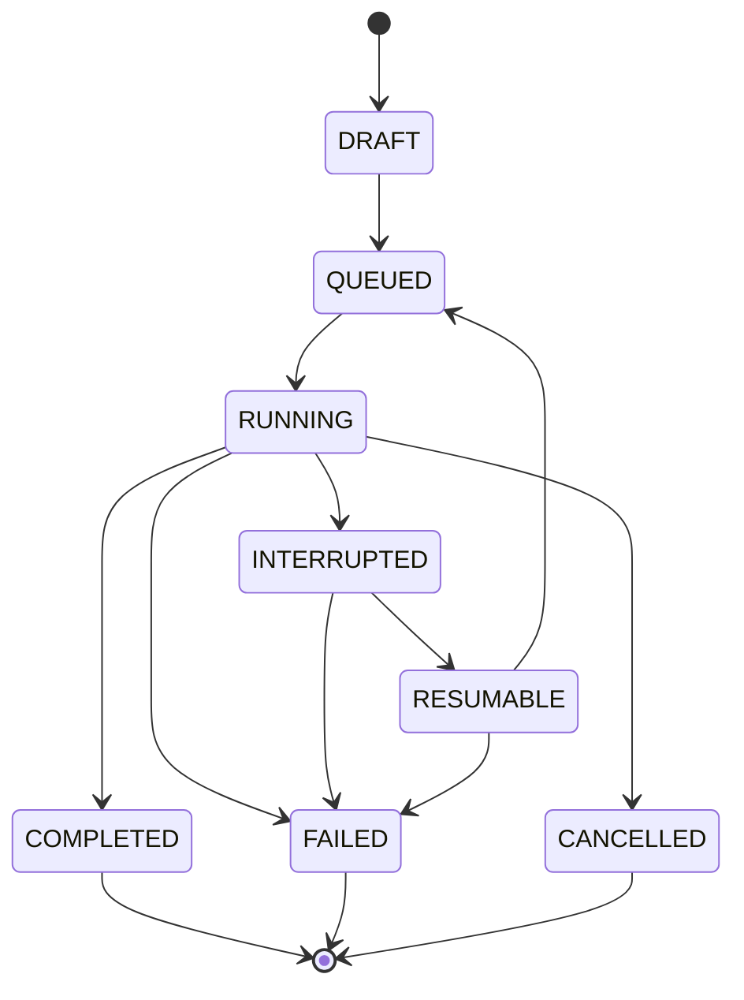
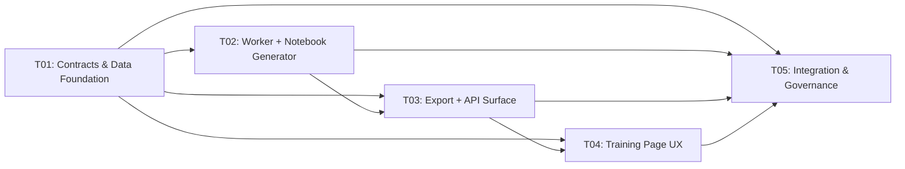

# GHARIBO AI LAB — Milestone 2 Architecture: Zero-Cost Training Pipeline

| Field | Value |
|-------|-------|
| **Document Owner** | Architecture (GHARIBO AI LAB) |
| **Type** | Architecture |
| **Status** | Frozen |
| **Version** | 1.0.0 |
| **Last Updated** | 2026-09-14 |

> **Incremental design for Milestone 2.** This document is **additive** to the frozen
> `docs/ARCHITECTURE.md` v1.0.0 (M1). It introduces the Training Package contract, the
> provider-neutral `TrainingWorker` abstraction, the Gold Pipeline, content-addressed dataset
> versions, provenance/hashing, and the Kaggle worker. It **does not contradict** any M1 decision;
> where it extends a frozen area it does so through a new ADR (ADR-0011 … ADR-0014).
>
> Implements `docs/PRD_MILESTONE_2.md` requirements **P0-01 … P0-21**. Verified stack facts are
> taken from `.workbuddy-ai/artifacts/m2-stack-facts.md` as ground truth.

---

## 1. Scope & Relationship to the Frozen M1 Baseline

### 1.1 What M2 adds (additive only)

| Area | M2 addition | PRD req |
|---|---|---|
| Architecture | Provider-neutral `TrainingWorker` interface + `KaggleTrainingWorker` (Worker #1) | P0-01 |
| Contract | Canonical, immutable, self-describing **Training Package** (manifest + inputs + notebook) | P0-02, P0-03 |
| Execution | Deterministic Kaggle `.ipynb` generator (no secrets, no personal paths) | P0-04 |
| Data | **Gold Pipeline** (`TRAINING_READY` gate) + **content-addressed immutable dataset versions** + deterministic hashed splits | P0-14, P0-15 |
| Provenance | Dataset hash, split hashes, git SHA, base-model revision, engine version, environment metadata, artifact integrity hashes | P0-16, §8 |
| Resilience | `INTERRUPTED` / `RESUMABLE` states, checkpointing + resume, `/kaggle/working` persistence | P0-10, P0-11, P0-19, P0-20 |
| UX | Training page M2 flow: version selector, config inspector, package export, exact instructions, resilience panel | P0-17 |
| Governance | ADR-0011 … ADR-0014, updated `docs:facts` | P0-21 |

### 1.2 What is explicitly **unchanged** (frozen M1)

- The tech stack, the Next.js Route-Handler-as-backend pattern (ADR-0001), the SQLite +
  `better-sqlite3` Repository Pattern (ADR-0002), the `ModelProvider` abstraction (ADR-0003),
  credentials-by-reference (ADR-0004), the Data Factory state vocabulary (ADR-0007), and the
  Model Registry status vocabulary (ADR-0008).
- The `{code, data, message}` API envelope and the `ApiResponse<T>` helper.
- The Python `services/trainer` **pre-flight** contract. M2 does **not** turn `/train` on; the
  Kaggle worker is where training happens. `POST /train` stays **501**.
- All M1 tables and columns remain; M2 only **adds** columns (idempotently) and **adds** tables.
- **No promotion**: `GHARIBO-exp-001` is registered `EXPERIMENT` only. No `GHARIBO-V0.1`/`GHARIBO-V1`.

### 1.3 The one honest correction to the M1 record

`docs/MODEL_REGISTRY.md` §"Hard Rules" claims the system "blocks invalid transitions", but in M1
the Data Factory pipeline and the registry gates are enforced **only in the UI** — no server-side
check exists. M2 **closes that gap server-side** (§7, §8) and this document says so plainly rather
than repeating the claim. The corresponding domain-spec wording is corrected under a separate
governance edit (hand-off item O5, §15).

---

## 2. The `TrainingWorker` Abstraction

`TrainingWorker` mirrors the M1 `ModelProvider` abstraction (ADR-0003) exactly in shape: a small
interface in `apps/web/lib/workers/index.ts`, a runtime factory, and one implementation per worker.
The interface is **pure** — every method is a total function from a `TrainingPackage` (plain data)
to an artifact (files, instructions, status). No method touches a GPU, the network, or a secret.
That is what makes it provider-neutral: the *package* describes **what** to train; the *worker*
decides **where** and **how** to execute it.

### 2.1 TypeScript interface (exact)

```typescript
// packages/shared/src/types/training-worker.ts
export type TrainingWorkerId = "kaggle";

export type WorkerRunState =
  | "PENDING" | "RUNNING" | "COMPLETED" | "FAILED" | "INTERRUPTED" | "RESUMABLE" | "CANCELLED";

export interface WorkerCapabilities {
  gpuClass: string;                 // "NVIDIA T4 (16 GB, sm_75)"
  dtype: "fp16";                    // T4 = Turing: bf16 unsupported
  supportsResume: boolean;          // true
  supportsSecrets: boolean;         // true (Kaggle Secrets)
  persistentPath: string;           // "/kaggle/working"
  persistentQuotaBytes: number;     // 20 * 1024 ** 3
  maxSessionSeconds: number;        // 43200 (~12h)
}

export interface WorkerStatus {
  state: WorkerRunState;
  detail: string;
  updatedAt: string;                // ISO 8601
}

export interface ResumeRequest {
  runId: string;
  checkpointRef: string;            // re-attached output dir or Kaggle Dataset path
  resumeFromCheckpoint: string;     // checkpoint-<step> directory
}

export interface ResumePlan {
  packagePatch: { resumeFromCheckpoint: string };   // feeds a NEW immutable package
  instructions: string[];
}

export interface NotebookArtifact {
  filename: string;                 // "GHARIBO-exp-001.ipynb"
  content: string;                  // deterministic .ipynb JSON
  sha256: string;
}

export interface BundleFile {
  relativePath: string;             // e.g. "manifest.json"
  content: string;                  // UTF-8; binary artifacts are not bundled
  sha256: string;
}

export interface WorkerInstructions {
  title: string;
  steps: string[];                  // exact operator steps (no secrets)
}
```

```typescript
// apps/web/lib/workers/index.ts
export interface TrainingWorker {
  readonly id: TrainingWorkerId;
  readonly displayName: string;
  readonly capabilities: WorkerCapabilities;

  /** Deterministic: same package → byte-identical notebook. No secrets, no personal paths. */
  renderNotebook(pkg: TrainingPackage): NotebookArtifact;

  /** The on-disk bundle layout (manifest + inputs + notebook + checksums). */
  buildBundle(pkg: TrainingPackage): BundleFile[];

  /** Exact operator steps to run this package on this worker. */
  instructions(pkg: TrainingPackage): WorkerInstructions;

  /** Normalises a worker-reported status into GHARIBO's resilience states (§10). */
  normalizeStatus(raw: unknown): WorkerStatus;

  /** Turns a resume request into the patch + steps for a NEW package. */
  planResume(req: ResumeRequest): ResumePlan;
}

export function getTrainingWorker(id: TrainingWorkerId): TrainingWorker;   // factory, mirrors getProvider()
export const TRAINING_WORKERS: readonly TrainingWorker[];                  // registry for discovery
```

### 2.2 Why provider-neutral

- The package carries **no** worker field. `artifact_destination` is optional and independent of
  the worker. A future free-tier or self-hosted worker (P2-01) implements the same interface with
  zero changes to the package schema or the DB.
- `capabilities` is the only worker-specific surface the UI reads; the UI never branches on
  `workerId`.
- `normalizeStatus` is the single place a worker's native status vocabulary is translated into
  GHARIBO states, so the resilience state machine (§10) is worker-independent.

### 2.3 `KaggleTrainingWorker`

`apps/web/lib/workers/kaggle/index.ts` implements every method:

| Method | Kaggle implementation |
|---|---|
| `renderNotebook` | Fills `notebook.template.ipynb` with the package JSON → canonical `.ipynb` (§9). |
| `buildBundle` | `manifest.json`, `dataset/{train,validation,test}.jsonl`, `dataset/dataset.json`, `notebook/<exp>.ipynb`, `README.md`, `CHECKSUMS.sha256`. |
| `instructions` | "Upload the bundle as a Kaggle Dataset (or attach it), create a Notebook, attach the Kaggle Dataset, enable Internet, add an `HF_TOKEN` Secret only if uploading, run as **Save Version** (committed) so `/kaggle/working` persists." |
| `normalizeStatus` | Maps a Kaggle run's terminal marker file / traceback presence to `COMPLETED`/`FAILED`/`INTERRUPTED` (suggestion only — §10). |
| `planResume` | Points `resume_from_checkpoint` at the re-attached `outputs/checkpoint-<step>` and returns the re-attach steps. |

`capabilities`: `gpuClass="NVIDIA T4 (16 GB, sm_75)"`, `persistentPath="/kaggle/working"`,
`persistentQuotaBytes=21474836480`, `maxSessionSeconds=43200`.

---

## 3. The Canonical Training Package

### 3.1 TypeScript type (camelCase, in `@gharibo/shared`)

```typescript
// packages/shared/src/types/training-package.ts
export const TRAINING_PACKAGE_SCHEMA_VERSION = "1.0.0";

export interface SplitHashes { train: string; validation: string; test: string; }

export interface SplitPolicy {
  algorithm: "seeded-shuffle-sha256";
  seed: number;
  ratios: { train: number; validation: number; test: number };   // sum = 1.0
  minimumRecordsPerSplit: number;   // recommended 10; configurable (Q1)
}

export interface DatasetRef {
  datasetId: string;
  datasetVersion: string;           // human version label, e.g. "v1"
  datasetVersionId: string;         // content-addressed id = datasetHash
  datasetHash: string;              // sha256 hex
  splitHashes: SplitHashes;
  splitPolicy: SplitPolicy;
  recordCount: number;
}

export interface EngineDependency {
  name: string;                     // "torch" | "unsloth" | "unsloth_zoo" | ...
  source: "pip" | "git";
  spec: string;                     // exact pinned spec recorded at freeze (Q10)
  resolvedVersion: string | null;   // exact resolved version, verified by equality
  url: string | null;               // git URLs where applicable
}

export interface EngineConfig {
  engine: "unsloth";
  engineVersion: string;
  dependencies: EngineDependency[];
}

export interface LoRAConfig {
  r: number;                        // ← training_runs.lora_rank
  alpha: number;                    // ← training_runs.lora_alpha
  targetModules: string[];          // ← training_runs.target_modules
  dropout: number;                  // 0 (optimized path)
  bias: "none" | "all" | "lora_only";  // "none"
}

export interface CheckpointPolicy {
  saveStrategy: "steps";
  saveSteps: number;                // 50 (Q3)
  saveTotalLimit: number;           // 2 (Q3)
  resumeFromCheckpoint: string | null;
}

export interface ArtifactDestination {
  kind: "hf" | "local";
  repoId: string | null;            // required for "hf"
  private: boolean;                 // must be true for "hf"
  path: string | null;              // local export path for "local"
  tokenSecretName: string | null;   // Kaggle Secret NAME only, never the token
}

export interface EvaluationConfig {
  executed: false;                  // Q5: declared intent only
  status: "NOT_RUN";
  benchmarkCategories: BenchmarkCategory[];
  researchMetrics: ResearchMetric[];
}

export interface EnvironmentMetadata {
  os: string;
  pythonVersion: string;
  packages: Record<string, string>;
  gpu: string | null;
  cuda: string | null;
}

export interface HarmonyMapping {
  developerTemplateId: string;      // domain-agnostic framing template (Q1/Q7 left to CTO)
  reasoningEffort: "low" | "medium" | "high";
  hiddenChannels: ["analysis"];     // never shown to end users
}

export interface TrainingPackage {
  schemaVersion: string;            // "1.0.0"
  packageId: string;                // sha256 of the canonical manifest — content address
  experimentId: string;             // "GHARIBO-exp-001"
  gitCommitSha: string;
  baseModel: string;                // "openai/gpt-oss-20b" (identity/lineage)
  baseModelRevision: string;        // pinned revision
  loaderModelId: string;            // "unsloth/gpt-oss-20b" (4-bit representation loaded)
  dataset: DatasetRef;
  engine: EngineConfig;
  quantization: "4-bit";
  lora: LoRAConfig;
  method: "QLoRA + SFT";
  sequenceLength: number;           // 1024 default; auto-downgrade to 512 if VRAM < 15 GB (Q2)
  batch: { perDeviceTrainBatchSize: number; gradientAccumulationSteps: number };
  optimizer: string;                // "adamw_8bit"
  learningRate: number;
  epochs: number | null;
  maxSteps: number | null;
  warmupSteps: number;
  lrSchedulerType: string;          // "linear"
  weightDecay: number;
  dtype: "fp16";
  seed: number;
  checkpointPolicy: CheckpointPolicy;
  artifactDestination: ArtifactDestination | null;   // null = local fallback (Q4)
  evaluationConfig: EvaluationConfig;
  environmentMetadata: EnvironmentMetadata;
  harmony: HarmonyMapping;
  createdAt: string;                // ISO 8601 UTC
}
```

### 3.2 JSON manifest shape (`manifest.json`, snake_case)

The **wire** manifest uses `snake_case` field names **verbatim from PRD §6.1** (so the
"100 % of §6.1 fields present" acceptance test is literal). The TS type above is camelCase; the
serializer `toManifestJson(pkg)` in `apps/web/lib/training/package.ts` maps between them exactly as
the repositories map `snake_case` rows ↔ camelCase domain objects (M1 §7.1 convention).

```jsonc
{
  "schema_version": "1.0.0",
  "package_id": "<sha256 hex of this manifest with package_id="" >",
  "experiment_id": "GHARIBO-exp-001",
  "git_commit_sha": "<40-hex>",
  "base_model": "openai/gpt-oss-20b",
  "base_model_revision": "<pinned>",
  "loader_model_id": "unsloth/gpt-oss-20b",
  "dataset": {
    "dataset_id": "<uuid>",
    "dataset_version": "v1",
    "dataset_version_id": "<sha256 hex>",
    "dataset_hash": "<sha256 hex>",
    "split_hashes": { "train": "<hex>", "validation": "<hex>", "test": "<hex>" },
    "split_policy": {
      "algorithm": "seeded-shuffle-sha256",
      "seed": 3407,
      "ratios": { "train": 0.8, "validation": 0.1, "test": 0.1 },
      "minimum_records_per_split": 10
    },
    "record_count": 1234
  },
  "engine": {
    "engine": "unsloth",
    "engine_version": "<pinned>",
    "dependencies": [
      { "name": "torch", "source": "pip", "spec": "torch>=2.8.0", "resolved_version": "2.8.x", "url": null },
      { "name": "triton", "source": "pip", "spec": "triton>=3.4.0", "resolved_version": "3.4.x", "url": null },
      { "name": "unsloth_zoo", "source": "git", "spec": "@git+https://github.com/unslothai/unsloth-zoo", "resolved_version": null, "url": "https://github.com/unslothai/unsloth-zoo" },
      { "name": "unsloth", "source": "git", "spec": "@git+https://github.com/unslothai/unsloth", "resolved_version": null, "url": "https://github.com/unslothai/unsloth" },
      { "name": "transformers", "source": "git", "spec": "@git+https://github.com/huggingface/transformers", "resolved_version": null, "url": "https://github.com/huggingface/transformers" },
      { "name": "triton_kernels", "source": "git", "spec": "@05b2c186c1b6c9a08375389d5efe9cb4c401c075", "resolved_version": null, "url": "https://github.com/triton-lang/triton.git" }
    ]
  },
  "quantization": "4-bit",
  "lora": { "r": 16, "alpha": 32, "target_modules": ["q_proj","k_proj","v_proj","o_proj","gate_proj","up_proj","down_proj"], "dropout": 0, "bias": "none" },
  "method": "QLoRA + SFT",
  "sequence_length": 1024,
  "batch": { "per_device_train_batch_size": 1, "gradient_accumulation_steps": 4 },
  "optimizer": "adamw_8bit",
  "learning_rate": 0.0002,
  "epochs": 1,
  "max_steps": null,
  "warmup_steps": 5,
  "lr_scheduler_type": "linear",
  "weight_decay": 0.01,
  "dtype": "fp16",
  "seed": 3407,
  "checkpoint_policy": { "save_strategy": "steps", "save_steps": 50, "save_total_limit": 2, "resume_from_checkpoint": null },
  "artifact_destination": null,
  "evaluation_config": {
    "executed": false,
    "status": "NOT_RUN",
    "benchmark_categories": ["Reasoning","Instruction Following","Structured Output","Research","Source Fidelity","Hallucination Resistance"],
    "research_metrics": ["schema_correctness","record_precision","duplicate_rate","unsupported_claim_rate","source_coverage","taxonomy_accuracy"]
  },
  "environment_metadata": { "os": "", "python_version": "", "packages": {}, "gpu": null, "cuda": null },
  "harmony": { "developer_template_id": "research-structured-knowledge", "reasoning_effort": "medium", "hidden_channels": ["analysis"] },
  "created_at": "2026-09-14T00:00:00.000Z"
}
```

Required vs optional: **every** key above is required except `artifact_destination` (nullable —
absent/`null` is valid = local fallback), `epochs`/`max_steps` (exactly one non-null),
`base_model_revision`/`resolved_version` (may be `"unknown"`/`null` if the upstream does not expose
one, but the field must exist), and the inner fields of `environment_metadata` (empty until a run
executes).

### 3.3 On-disk bundle layout (the package zip)

```
gharibo-<experiment_id>-<packageId[0:12]>/
├── manifest.json                 # §3.2, canonical, byte-stable
├── README.md                     # operator instructions (from worker.instructions())
├── CHECKSUMS.sha256              # manifest-of-hashes (§5.3)
├── dataset/
│   ├── dataset.json              # DatasetRef (redundant, self-describing)
│   ├── train.jsonl               # canonical lines (sorted keys, no whitespace)
│   ├── validation.jsonl
│   └── test.jsonl
└── notebook/
    └── <experiment_id>.ipynb     # run-specific copy (Q6: template + run-specific copy)
```

The **canonical template** `apps/web/lib/workers/kaggle/notebook.template.ipynb` is committed to
the repo; the run-specific copy is generated from it. Both are delivered (Q6).

### 3.4 Schema-versioning rule

`schema_version` is semver `MAJOR.MINOR.PATCH`.

- **Reader** accepts a package iff `major` equals the reader's supported major.
- A **higher minor** is forward-compatible: unknown keys are ignored (packages are self-describing).
- A **different major** is a hard failure (HTTP 400 on export/import; notebook aborts).
- The **generator** refuses to emit a package it cannot validate against its own schema.
- **Immutability**: a package is immutable once issued. Any change (config, data, resume) produces
  a **new** package with a new `package_id`; in-place edits are never performed.

### 3.5 Validation rules — what makes a package **invalid**

`validatePackage(pkg): ValidationIssue[]` (in `apps/web/lib/training/validate.ts`) returns
`{level: "ERROR"|"WARN", field, message}[]`. **Any ERROR blocks export** (HTTP 400) and blocks the
notebook's pre-training gate. Errors:

1. Any required §3.2 field missing/empty.
2. `schema_version` major unsupported.
3. `git_commit_sha` not 40-hex and not `"unknown"`.
4. `dataset.dataset_hash` / any `split_hashes.*` missing or not 64-hex.
5. Any split below `split_policy.minimum_records_per_split` (empty splits are invalid — Q1).
6. The dataset version is not `TRAINING_READY`.
7. `lora.r`/`lora.alpha`/`lora.target_modules` not derivable from the run's stored columns (null).
8. `dtype !== "fp16"`.
9. `sequence_length ∉ {512, 1024}`.
10. `epochs` and `max_steps` both null, or both non-null.
11. `engine.dependencies` empty.
12. `artifact_destination.kind === "hf"` but `repo_id` missing or `private !== true`.
13. `evaluation_config.executed !== false` or `status !== "NOT_RUN"` (no fabricated results — Q5).
14. `checkpoint_policy.save_strategy !== "steps"` (resume requires step checkpoints).
15. `package_id` does not equal the recomputed hash of the canonical manifest.

---

## 4. Record → Harmony Mapping

GHARIBO records are `{ input, context, chosen_output }`-shaped; gpt-oss expects **OpenAI Harmony**.
The mapping is explicit, deterministic, and carried in the package (`harmony`). It is
**domain-agnostic** (Q1/Q7 are the CTO's to choose): the `developer` framing is a template id, not a
hardcoded domain.

### 4.1 Channel assignment

| GHARIBO field | Harmony role → channel | Rule |
|---|---|---|
| Task framing / instructions | `developer` | Rendered from `harmony.developer_template_id`; domain-agnostic template, not per-record data |
| `input` + `context` | `user` | `context` appended as `"\n\nContext:\n" + context` when non-null |
| Reasoning | `assistant` → `analysis` | Only when the record has `reasoning` (new nullable column, §6); else the channel is omitted |
| `chosen_output` (fallback `expected_output`) | `assistant` → `final` | The user-facing answer |
| Tool interactions | `tool` / `assistant` → `commentary` | Only when present; omitted otherwise |

Rendering uses the **Harmony-aware chat template**:
`tokenizer.apply_chat_template(convo, tokenize=False, add_generation_prompt=False, reasoning_effort=<harmony.reasoning_effort>)`.
The notebook must **not** hand-roll the special tokens; it must go through the tokenizer so the
`<|start|>`, `<|end|>`, `<|message|>`, `<|channel|>`, `<|constrain|>`, `<|call|>`, `<|return|>`
tokens are emitted exactly.

### 4.2 Keeping `analysis` out of user-facing output

`analysis` is chain-of-thought and **must never be shown to end users**.

1. The package declares `harmony.hidden_channels = ["analysis"]` — machine-readable.
2. A shared constant `HARMONY_HIDDEN_CHANNELS: readonly string[] = ["analysis"]` and a helper
   `stripHiddenChannels(rendered)` live in `@gharibo/shared`; any future serving path (P2-03) must
   render only `final`.
3. The notebook **trains on** the `analysis` channel (that is the point) but **never prints**
   rendered training text to cell output; log lines reference record indices only.
4. The Training page config inspector shows the mapping and the hidden-channel rule, never a
   rendered `analysis` string.

The TS helper `renderHarmony(record, mapping): HarmonyMessage[]` in
`apps/web/lib/training/harmony.ts` produces the same message array for tests and documentation; it
is the single source of truth for the mapping and is asserted against the notebook's behaviour by
a golden test.

---

## 5. Provenance & Hashing Design

All hashing is SHA-256 over UTF-8 bytes. The TS implementation lives in
`apps/web/lib/training/hash.ts` (`node:crypto`); the notebook reimplements the **same algorithm** in
`hashlib` (§9). Canonicalization lives in `apps/web/lib/training/canonical.ts`.

### 5.1 Canonical record serialization → dataset hash

The JSONL files store **canonical lines**, so the notebook hashes raw line bytes and never needs to
re-canonicalize:

- `canonicalRecord(r)` = a JSON object with keys in this **fixed order**:
  `task_type, domain, language, input, context, expected_output, chosen_output, reasoning, source,
  source_url, license, tags`. Values: strings trimmed and **NFC-normalized**; `null` for absent;
  `tags` **sorted lexicographically**. Volatile fields (`created_at`, `updated_at`, `quality_score`,
  DB `id`) are **excluded** — they do not affect training content.
- The canonical line = `JSON.stringify(canonicalRecord(r))` (no whitespace).
- `recordLineHash_i = sha256(lineBytes_i)`.
- **Dataset hash** = `sha256( sort(recordLineHash_i).join("\n") )` — **order-independent**
  (membership is content-addressed, so record ordering and DB ids never change the hash).

### 5.2 Deterministic seeded split algorithm (precise, reproducible)

```
Input: set of records R, seed s (integer), ratios (train, val, test) summing to 1.0, minPerSplit m.

1. For each record r in R:  k(r) = sha256( utf8( str(s) + ":" + recordLineHash(r) ) )   # 256-bit int
2. Sort R ascending by k(r); ties broken by recordLineHash(r) lexicographically.
3. N = |R|; nTrain = floor(N * trainRatio); nVal = floor(N * valRatio); nTest = N - nTrain - nVal.
4. Assign the first nTrain sorted records → train, next nVal → validation, remaining → test.
5. If nTrain < m or nVal < m or nTest < m → the version cut FAILS LOUDLY (no version is created).
6. splitHash(S) = sha256( sort(recordLineHash(r) for r in S).join("\n") )
```

This is fully deterministic given `(R, s, ratios)`. Because assignment is driven by the hash of each
record's content, **re-cutting identical inputs on any machine reproduces identical splits and
hashes** — independent of insertion order.

### 5.3 Artifact integrity hash (manifest-of-hashes — Q9)

For the produced artifact set (adapter files, `trainer_state.json`, `metrics.json`, `manifest.json`,
`training.log`):

- `fileHash(p) = sha256(fileBytes)`.
- **Rollup** = `sha256( sort( (relative_path + "\t" + fileHash) ).join("\n") )` over the sorted
  `(relative_path, sha256)` pairs.
- Written to `CHECKSUMS.sha256` (one `sha256  path` line per file + a final rollup line) and
  persisted in the `training_artifacts` table (§6). The import path (P1-02) re-hashes and compares.

### 5.4 Provenance record

Every experiment stores a `provenance` JSON (new column, §6): dataset hash, split hashes, git SHA,
base model identity + revision + loader id, engine version + dependency set, environment metadata,
and the artifact rollup hash. `experiments.code_version` is populated with the **real git SHA**.

---

## 6. Data Model Changes

Conventions preserved from M1: `TEXT` ids, `TEXT` ISO-8601 timestamps, `INTEGER` booleans,
JSON-in-`TEXT` columns.

### 6.1 New tables (4)

```sql
-- Issued, immutable Training Packages.
CREATE TABLE IF NOT EXISTS training_packages (
  id TEXT PRIMARY KEY,                -- package_id (sha256 of the canonical manifest)
  experiment_id TEXT NOT NULL,
  schema_version TEXT NOT NULL,
  manifest TEXT NOT NULL,             -- canonical manifest JSON (snake_case)
  manifest_hash TEXT NOT NULL,        -- == id (content address)
  dataset_id TEXT,
  dataset_version_id TEXT,
  run_id TEXT,
  worker_id TEXT NOT NULL DEFAULT 'kaggle',
  notebook_sha256 TEXT,
  bundle_path TEXT,                   -- export location (data/exports/...)
  created_at TEXT NOT NULL,
  FOREIGN KEY (dataset_id) REFERENCES datasets(id) ON DELETE SET NULL,
  FOREIGN KEY (run_id) REFERENCES training_runs(run_id) ON DELETE SET NULL
);

-- Deterministic split membership per dataset version.
CREATE TABLE IF NOT EXISTS dataset_splits (
  dataset_id TEXT NOT NULL,
  split_name TEXT NOT NULL,           -- 'train' | 'validation' | 'test'
  record_id TEXT NOT NULL,
  record_line_hash TEXT NOT NULL,     -- sha256 of the canonical line
  PRIMARY KEY (dataset_id, split_name, record_id),
  FOREIGN KEY (dataset_id) REFERENCES datasets(id) ON DELETE CASCADE,
  FOREIGN KEY (record_id) REFERENCES data_factory_records(id) ON DELETE CASCADE
);

-- Per-file artifact integrity hashes (manifest-of-hashes).
CREATE TABLE IF NOT EXISTS training_artifacts (
  id TEXT PRIMARY KEY,
  package_id TEXT NOT NULL,
  relative_path TEXT NOT NULL,
  kind TEXT NOT NULL,                 -- 'adapter' | 'trainer_state' | 'metrics' | 'manifest' | 'log'
  sha256 TEXT NOT NULL,
  size_bytes INTEGER NOT NULL DEFAULT 0,
  rollup_hash TEXT,                   -- same rollup repeated per package row (denormalised)
  created_at TEXT NOT NULL,
  FOREIGN KEY (package_id) REFERENCES training_packages(id) ON DELETE CASCADE
);

-- Resilience state-transition audit log.
CREATE TABLE IF NOT EXISTS training_run_events (
  id TEXT PRIMARY KEY,
  run_id TEXT NOT NULL,
  from_status TEXT,
  to_status TEXT NOT NULL,
  reason TEXT,
  source TEXT NOT NULL,               -- 'api' | 'import' | 'operator' | 'notebook'
  created_at TEXT NOT NULL,
  FOREIGN KEY (run_id) REFERENCES training_runs(run_id) ON DELETE CASCADE
);

CREATE INDEX IF NOT EXISTS idx_training_packages_experiment ON training_packages(experiment_id);
CREATE INDEX IF NOT EXISTS idx_dataset_splits_dataset ON dataset_splits(dataset_id, split_name);
CREATE INDEX IF NOT EXISTS idx_training_artifacts_package ON training_artifacts(package_id);
CREATE INDEX IF NOT EXISTS idx_run_events_run ON training_run_events(run_id);
```

### 6.2 New columns on existing tables (idempotent)

SQLite has no `ADD COLUMN IF NOT EXISTS`. M2 adds an idempotent helper to
`apps/web/lib/db/migrate.ts`:

```typescript
/** Adds a column only if it is absent (PRAGMA table_info is authoritative). */
function ensureColumn(db: Database.Database, table: string, column: string, ddl: string): void {
  const cols = db.prepare(`PRAGMA table_info(${table})`).all() as { name: string }[];
  if (!cols.some((c) => c.name === column)) db.exec(`ALTER TABLE ${table} ADD COLUMN ${ddl}`);
}
```

`runMigrations()` then calls `ensureColumn(...)` for each of the following, after the
`CREATE TABLE IF NOT EXISTS` statements. Existing rows receive the column default.

```sql
-- datasets: content-addressed, immutable versions
ALTER TABLE datasets ADD COLUMN dataset_hash TEXT;                       -- sha256, order-independent
ALTER TABLE datasets ADD COLUMN dataset_version_id TEXT;                 -- == dataset_hash
ALTER TABLE datasets ADD COLUMN split_policy TEXT NOT NULL DEFAULT '{}';
ALTER TABLE datasets ADD COLUMN split_hashes TEXT NOT NULL DEFAULT '{}';
ALTER TABLE datasets ADD COLUMN schema_version TEXT NOT NULL DEFAULT '1.0.0';
ALTER TABLE datasets ADD COLUMN status TEXT NOT NULL DEFAULT 'DRAFT';    -- 'DRAFT'|'TRAINING_READY'
ALTER TABLE datasets ADD COLUMN parent_dataset_id TEXT;

-- data_factory_records: reasoning channel + gold-pipeline audit
ALTER TABLE data_factory_records ADD COLUMN reasoning TEXT;
ALTER TABLE data_factory_records ADD COLUMN pipeline_updated_at TEXT;

-- training_runs: engine values M2 derives from (never hardcoded)
ALTER TABLE training_runs ADD COLUMN max_seq_length INTEGER;
ALTER TABLE training_runs ADD COLUMN optimizer TEXT;
ALTER TABLE training_runs ADD COLUMN warmup_steps INTEGER;
ALTER TABLE training_runs ADD COLUMN lr_scheduler_type TEXT;
ALTER TABLE training_runs ADD COLUMN weight_decay REAL;
ALTER TABLE training_runs ADD COLUMN dtype TEXT;
ALTER TABLE training_runs ADD COLUMN save_strategy TEXT;
ALTER TABLE training_runs ADD COLUMN save_steps INTEGER;
ALTER TABLE training_runs ADD COLUMN save_total_limit INTEGER;
ALTER TABLE training_runs ADD COLUMN base_model_revision TEXT;
ALTER TABLE training_runs ADD COLUMN loader_model_id TEXT;
ALTER TABLE training_runs ADD COLUMN worker_id TEXT;
ALTER TABLE training_runs ADD COLUMN package_id TEXT;
ALTER TABLE training_runs ADD COLUMN resume_from_checkpoint TEXT;

-- experiments: package + manifest + provenance + real code version
ALTER TABLE experiments ADD COLUMN package_id TEXT;
ALTER TABLE experiments ADD COLUMN manifest TEXT NOT NULL DEFAULT '{}';
ALTER TABLE experiments ADD COLUMN provenance TEXT NOT NULL DEFAULT '{}';
```

**Engine derivation (P0-09 — no hardcoding).** The package's QLoRA values come from the run's
**stored columns**, mapped explicitly:

| Package field | `training_runs` column |
|---|---|
| `lora.r` | `lora_rank` |
| `lora.alpha` | `lora_alpha` |
| `lora.target_modules` | `target_modules` |
| `sequence_length` | `max_seq_length` |
| `batch.per_device_train_batch_size` | `batch_size` |
| `batch.gradient_accumulation_steps` | `gradient_accumulation` |
| `learning_rate` | `learning_rate` |
| `epochs` | `epochs` |
| `optimizer` | `optimizer` |
| `seed` | `seed` |
| `warmup_steps` / `lr_scheduler_type` / `weight_decay` / `dtype` | same-named new columns |

> **Note (verified against code, not the briefing).** The actual `training_runs` DDL stores
> `epochs`/`batch_size`/`gradient_accumulation` (not `num_epochs`/`per_device_train_batch_size`/
> `gradient_accumulation_steps`) and has **no** `max_seq_length` or `optimizer` column today. Those
> two are therefore added by this milestone. The nullable `train_examples`/`validation_examples`
> columns remain unused (M2 derives counts from the split, not from them).

**Migration approach:** keep idempotent `CREATE TABLE IF NOT EXISTS` + `ensureColumn`. No versioned
migration framework is introduced (consistent with M1 §7.6). All statements run inside the existing
single transaction in `runMigrations()`.

---

## 7. Repository Layer Changes

### 7.1 New repositories

```typescript
// apps/web/lib/db/repositories/training-packages.ts
export const trainingPackagesRepository: {
  create(input: { manifest: string; experimentId: string; datasetId: string | null;
                  datasetVersionId: string | null; runId: string | null;
                  notebookSha256: string | null; bundlePath: string | null }): TrainingPackageRow;
  get(id: string): TrainingPackageRow | null;
  listByExperiment(experimentId: string): TrainingPackageRow[];
  getByRun(runId: string): TrainingPackageRow | null;
  remove(id: string): boolean;
};

// apps/web/lib/db/repositories/dataset-splits.ts
export const datasetSplitsRepository: {
  replace(datasetId: string, rows: { splitName: SplitName; recordId: string; recordLineHash: string }[]): void;
  listByDataset(datasetId: string): { splitName: SplitName; recordId: string; recordLineHash: string }[];
  listBySplit(datasetId: string, splitName: SplitName): string[];   // record ids
};

// apps/web/lib/db/repositories/training-artifacts.ts
export const trainingArtifactsRepository: {
  replaceForPackage(packageId: string, rows: { relativePath: string; kind: string; sha256: string; sizeBytes: number }[], rollupHash: string): void;
  listByPackage(packageId: string): TrainingArtifactRow[];
};

// apps/web/lib/db/repositories/training-run-events.ts
export const trainingRunEventsRepository: {
  append(e: { runId: string; fromStatus: RunStatus | null; toStatus: RunStatus; reason?: string | null; source: string }): TrainingRunEventRow;
  listByRun(runId: string): TrainingRunEventRow[];
};
```

### 7.2 New methods on existing repositories

```typescript
// datasets.ts — content-addressed cut (replaces the naive monotonic counter)
cutVersion(input: {
  name: string;
  recordIds: string[];
  splitPolicy: SplitPolicy;
}): DatasetWithSplits;                 // computes hashes + deterministic splits; throws on empty split
getByHash(datasetHash: string): Dataset | null;
getSplits(datasetId: string): Record<SplitName, string[]>;

// training-runs.ts — guarded transitions + package linkage
transition(id: string, to: RunStatus, opts: { reason?: string; source: string }): TrainingRun | null;
setPackage(id: string, packageId: string): TrainingRun | null;

// experiments.ts — package + provenance + real git SHA
setPackage(id: string, packageId: string): Experiment | null;
setProvenance(id: string, provenance: Record<string, unknown>): Experiment | null;

// data-factory.ts — SERVER-SIDE gold pipeline transition (closes the M1 UI-only gap)
transition(id: string, to: VerificationStatus, opts?: { reason?: string }): DataFactoryRecord;  // 400 on illegal move
```

### 7.3 Server-side enforcement (honest statement)

- **Gold Pipeline** (`dataFactoryRepository.transition`): an explicit allowed-transition table
  rejects illegal moves (`RAW→NORMALIZED→REVIEW_REQUIRED→APPROVED→TRAINING_READY`, with
  `→REJECTED` from review). A dataset version may only be cut from records in `TRAINING_READY`.
  This is **new** server-side enforcement; M1 enforced nothing.
- **Model Registry** (`modelRegistryRepository.promote`): `EXPERIMENT→CANDIDATE` now requires ≥1
  evaluation result **and** a training-run reference; `CANDIDATE→ACCEPTED` requires an evaluation
  with no critical regression. Creating a `GHARIBO-V0.1`/`GHARIBO-V1` entry is rejected outright.
  Again **new** — M1 had no server check despite `docs/MODEL_REGISTRY.md` claiming one.

---

## 8. API Surface

All responses use the M1 envelope `{code, data, message}` via `toApiResponse()` (code `0` =
success). **8 new route files / 9 new handlers** (existing files are untouched).

| Method | Path | Request | Response `data` |
|--------|------|---------|-----------------|
| GET | `/api/training-packages` | `?experimentId=` | `TrainingPackageSummary[]` |
| POST | `/api/training-packages` | `{ experimentId, runId, datasetId }` | `TrainingPackage` (validates; 400 on any ERROR) |
| GET | `/api/training-packages/[id]` | — | `{ package: TrainingPackage; manifest: string }` |
| GET | `/api/training-packages/[id]/export` | — | `application/zip` bundle (§3.3); fails loudly if not `TRAINING_READY` |
| POST | `/api/training-runs/[id]/resume` | `{ checkpointRef, resumeFromCheckpoint }` | `{ package: TrainingPackage }` (new immutable package) |
| POST | `/api/training-runs/[id]/import-results` | `{ manifest, metrics, artifacts? }` | `TrainingRun` (P1-01; verifies artifact hashes, P1-02) |
| GET | `/api/datasets/[id]/splits` | — | `{ splitPolicy, splitHashes, counts: {train,validation,test} }` |
| POST | `/api/data-factory/[id]/transition` | `{ to, reason? }` | `DataFactoryRecord` (400 on illegal transition) |
| GET | `/api/training-workers` | — | `{ id, displayName, capabilities }[]` |

**Export failure modes** (P0-03, "fails loudly"): dataset version not `TRAINING_READY` → 400;
hashes not computable → 400; `validatePackage` returns any ERROR → 400 with itemised issues.

---

## 9. Kaggle Worker + Notebook Design

### 9.1 Notebook sections mapped to the 16 required behaviours

The generated notebook has exactly these 16 cells/sections (one cell per behaviour; the section
index is stable so tests can assert on it):

| # | Section | Behaviour | Req |
|---|---|---|---|
| 1 | Header | Echo package metadata + **zero-cost policy** statement; assert no paid provider referenced | P0-13 |
| 2 | Hardware detect | Print GPU name, compute capability, VRAM, selected dtype | P0-05 |
| 3 | Budget gate | Assert VRAM ≥ ~14 GB **and** `dtype == fp16` (Turing); **abort before training**; auto-downgrade `max_seq_length` 1024→512 if VRAM < 15 GB | P0-05, Q2 |
| 4 | Install | Install the **pinned** set from `engine.dependencies` via `uv` | P0-06 |
| 5 | Verify deps | Compare installed versions to the pin by **exact equality**; import smoke test; fail on mismatch | P0-06, Q10 |
| 6 | Data | Load JSONL; recompute dataset + split hashes; **hard-fail on mismatch** | P0-07 |
| 7 | Harmony | Render records via `apply_chat_template(..., reasoning_effort=...)`; no `analysis` printed | P0-08 |
| 8 | Load model | `FastLanguageModel.from_pretrained(loader_model_id, load_in_4bit=True, max_seq_length=…)` | P0-08 |
| 9 | QLoRA | `get_peft_model` with `r`/`lora_alpha`/`target_modules` **from the package** | P0-09 |
| 10 | SFT config | `SFTConfig` from the package incl. `save_strategy=steps`, `save_steps`, `save_total_limit` | P0-09, P0-10 |
| 11 | Resume | If `resume_from_checkpoint` set → pass it to `trainer.train()` | P0-11 |
| 12 | Train | `trainer.train()` | P0-10 |
| 13 | Save | Save adapter + `trainer_state.json` + `metrics.json` + `manifest.json` under `/kaggle/working` | P0-10 |
| 14 | Checksums | Write `CHECKSUMS.sha256` (per-file + rollup, §5.3) | Q9, §8 |
| 15 | Upload | **Optional** private HF upload via Kaggle Secrets; else local-only | P0-12 |
| 16 | Finalize | Write completion marker + environment metadata; flush `training.log` to `/kaggle/working` | P0-19, P0-20 |

### 9.2 Deterministic notebook generation

`renderNotebook(pkg)` is pure. The template `notebook.template.ipynb` contains one sentinel cell
whose source is exactly `__GHARIBO_PACKAGE_JSON__`. The generator:

1. Substitutes the sentinel with `JSON.stringify(pkg)` (canonical, sorted keys).
2. Normalises the `.ipynb` JSON: fixed cell order, `"execution_count": null`, `"outputs": []`,
   stable `id`s, 1-space indent, trailing newline.

Result: **same package → byte-identical notebook** (`notebook.sha256` is stable and recorded in
`training_packages.notebook_sha256`). The notebook contains **no secrets and no personal paths** —
paths are derived from `/kaggle/working` and the package.

### 9.3 Resume

Resume never mutates a package. `planResume` produces a `packagePatch`, and the API re-issues a
**new** package with `checkpoint_policy.resume_from_checkpoint` set (new `package_id`). The notebook
passes `resume_from_checkpoint=<path>` to `SFTTrainer.train()`, which restores optimizer + scheduler
state from `trainer_state.json`. The manifest records the resume point; the run event log (§6.1)
records the `RESUMABLE→QUEUED` transition.

### 9.4 Secrets

```python
from kaggle_secrets import UserSecretsClient
token = None
try:
    token = UserSecretsClient().get_secret("HF_TOKEN")   # NAME only, value never printed
except Exception:
    token = None                                          # local fallback
```
The token is never written to any file, never printed, never included in the notebook source, and
never committed. `report_to="none"`. If `artifact_destination` is `null` or the secret is absent,
the upload section is skipped and local export is the complete result (Q4, P0-12).

---

## 10. Resilience State Machine

### 10.1 States

M1 states (unchanged): `DRAFT`, `QUEUED`, `RUNNING`, `COMPLETED`, `FAILED`, `CANCELLED`.
**New M2 states**: `INTERRUPTED`, `RESUMABLE`.

### 10.2 Allowed transitions



Any transition not listed is rejected (`trainingRunsRepository.transition` → 400). Every transition
appends a `training_run_events` row.

### 10.3 Who sets each state

| State | Set by | Trigger |
|---|---|---|
| `DRAFT` | API | Run created (M1) |
| `QUEUED` | API / operator | Run launched, or a resume package issued |
| `RUNNING` | operator / notebook status import | Training started |
| `COMPLETED` | **import step**, explicitly | Notebook **completion marker present** |
| `FAILED` | **import step**, explicitly | **Traceback/exception marker present** |
| `INTERRUPTED` | **import step / operator**, explicitly | Session ended with **no completion marker and no traceback** |
| `RESUMABLE` | **operator**, explicitly | Operator confirms a checkpoint **and** `trainer_state.json` exist |
| `CANCELLED` | operator | Manual cancel |

**Q8 (resolved):** `INTERRUPTED` vs `FAILED` is **explicitly set, never silently guessed**. A
documented heuristic *may suggest* `INTERRUPTED` (no completion marker **and** no traceback), but
the **recorded** state is written explicitly by the import step / operator. The heuristic's
suggestion is stored in the event log's `reason`, not as the state itself.

---

## 11. Free-Tier Storage Design

| Location | Persists? | Contents |
|---|---|---|
| `/kaggle/working` (≤20 GB) | **Yes** (as notebook Output on a committed/Save-Version run) | checkpoints (`save_total_limit=2`), `trainer_state.json`, LoRA adapter (`adapter_model.safetensors` + `adapter_config.json`), `metrics.json`, `manifest.json`, `training.log`, `CHECKSUMS.sha256`, the run-specific notebook copy, the small JSONL inputs |
| `/kaggle/temp`, HF cache, pip cache | **No** | downloaded model weights (~12–13 GB), caches — never relied upon |

**20 GB budget:** LoRA adapters are tens of MB; optimizer state for LoRA is small; with
`save_total_limit=2` and `save_steps=50` (Q3) the persistent footprint stays far under 20 GB. The
4-bit weights live in the ephemeral cache and are **not** persisted.

**Optional HF destination (Q4):** `artifact_destination` is **unset by default**; local
export/download is a complete fallback, so GHARIBO works with no external repository. When
configured, it must be a **private** HF repo within the free allowance, reached via Kaggle Secrets.
**GitHub never holds artifacts** (source/docs only). ADR-0014 records this.

---

## 12. File List (create / modify)

Paths are repo-relative. **C** = create, **M** = modify.

### 12.1 `packages/shared`

| File | |
|---|---|
| `packages/shared/src/types/training-package.ts` | C — §3.1 types |
| `packages/shared/src/types/training-worker.ts` | C — §2.1 types |
| `packages/shared/src/types/dataset.ts` | M — add `datasetHash`, `datasetVersionId`, `splitPolicy`, `splitHashes`, `status`, `SplitName` |
| `packages/shared/src/types/training-run.ts` | M — add `INTERRUPTED`/`RESUMABLE`, new engine fields |
| `packages/shared/src/types/experiment.ts` | M — add `packageId`, `manifest`, `provenance` |
| `packages/shared/src/types/index.ts` | M — barrel export |

### 12.2 `apps/web/lib`

| File | |
|---|---|
| `apps/web/lib/db/schema.ts` | M — 4 new tables + indexes (§6.1) |
| `apps/web/lib/db/migrate.ts` | M — `ensureColumn` + new ALTER columns (§6.2) |
| `apps/web/lib/db/repositories/training-packages.ts` | C |
| `apps/web/lib/db/repositories/dataset-splits.ts` | C |
| `apps/web/lib/db/repositories/training-artifacts.ts` | C |
| `apps/web/lib/db/repositories/training-run-events.ts` | C |
| `apps/web/lib/db/repositories/datasets.ts` | M — `cutVersion`, `getByHash`, `getSplits` |
| `apps/web/lib/db/repositories/training-runs.ts` | M — `transition`, `setPackage` |
| `apps/web/lib/db/repositories/experiments.ts` | M — `setPackage`, `setProvenance` |
| `apps/web/lib/db/repositories/data-factory.ts` | M — `transition` (server-side gate) |
| `apps/web/lib/db/repositories/model-registry.ts` | M — `promote` enforcement |
| `apps/web/lib/db/repositories/index.ts` | M — export new repos |
| `apps/web/lib/training/hash.ts` | C — sha256 helpers (§5) |
| `apps/web/lib/training/canonical.ts` | C — canonical record + line serialization (§5.1) |
| `apps/web/lib/training/split.ts` | C — deterministic seeded split (§5.2) |
| `apps/web/lib/training/harmony.ts` | C — record → Harmony mapping (§4) |
| `apps/web/lib/training/package.ts` | C — build + serialize + `packageId` (§3) |
| `apps/web/lib/training/validate.ts` | C — package validation (§3.5) |
| `apps/web/lib/training/export.ts` | C — assemble the bundle (§3.3) |
| `apps/web/lib/training/zip.ts` | C — zip writer |
| `apps/web/lib/workers/index.ts` | C — `TrainingWorker` interface + factory + registry (§2.1) |
| `apps/web/lib/workers/kaggle/index.ts` | C — `KaggleTrainingWorker` (§2.3) |
| `apps/web/lib/workers/kaggle/notebook.template.ipynb` | C — canonical template (Q6) |
| `apps/web/lib/workers/kaggle/notebook-render.ts` | C — deterministic renderer (§9.2) |
| `apps/web/lib/workers/kaggle/bundle.ts` | C — bundle layout |
| `apps/web/lib/workers/kaggle/instructions.ts` | C — operator steps |
| `apps/web/lib/workers/kaggle/status.ts` | C — status normalization |
| `apps/web/lib/preflight.ts` | M — honour `dataset_id` (currently ignored) |

### 12.3 `apps/web/app` (API + pages + components)

| File | |
|---|---|
| `apps/web/app/api/training-packages/route.ts` | C — GET, POST |
| `apps/web/app/api/training-packages/[id]/route.ts` | C — GET |
| `apps/web/app/api/training-packages/[id]/export/route.ts` | C — GET |
| `apps/web/app/api/training-runs/[id]/resume/route.ts` | C — POST |
| `apps/web/app/api/training-runs/[id]/import-results/route.ts` | C — POST |
| `apps/web/app/api/datasets/[id]/splits/route.ts` | C — GET |
| `apps/web/app/api/data-factory/[id]/transition/route.ts` | C — POST |
| `apps/web/app/api/training-workers/route.ts` | C — GET |
| `apps/web/app/(dashboard)/training/page.tsx` | M — M2 flow (§PRD §9) |
| `apps/web/app/(dashboard)/training/[runId]/page.tsx` | C — run/package detail |
| `apps/web/components/training/dataset-version-selector.tsx` | C |
| `apps/web/components/training/config-inspector.tsx` | C |
| `apps/web/components/training/package-export-panel.tsx` | C |
| `apps/web/components/training/resilience-panel.tsx` | C |
| `apps/web/components/training/run-detail.tsx` | C |

### 12.4 Docs

| File | |
|---|---|
| `docs/ARCHITECTURE_MILESTONE_2.md` | C — this document |
| `docs/adr/ADR-0011-training-worker-abstraction.md` | C |
| `docs/adr/ADR-0012-canonical-training-package.md` | C |
| `docs/adr/ADR-0013-content-addressed-dataset-versions.md` | C |
| `docs/adr/ADR-0014-zero-cost-artifact-policy.md` | C |
| `docs/adr/README.md` | M — index the 4 new ADRs |
| `docs/ARCHITECTURE.md` | M (lead-owned) — `docs:facts` block + version bump |

---

## 13. Task List (dependency-ordered, ≤6 tasks)

> First task is project infrastructure (contracts + data foundation). Each task names its files and
> its dependencies. Grouped by module/layer, not by file.

| Task | Name | Files | Depends |
|---|---|---|---|
| **T01** | **Contracts & data foundation** — shared types, DB schema + idempotent migration, hashing/canonicalization/split/harmony/package/validate libs, and all repository changes | `packages/shared/src/types/{training-package,training-worker,dataset,training-run,experiment,index}.ts`; `apps/web/lib/db/schema.ts`; `apps/web/lib/db/migrate.ts`; `apps/web/lib/db/repositories/{index,training-packages,dataset-splits,training-artifacts,training-run-events,datasets,training-runs,experiments,data-factory,model-registry}.ts`; `apps/web/lib/training/{hash,canonical,split,harmony,package,validate}.ts` | — |
| **T02** | **TrainingWorker abstraction + Kaggle worker + notebook generator** | `apps/web/lib/workers/index.ts`; `apps/web/lib/workers/kaggle/{index,notebook-render,bundle,instructions,status}.ts`; `apps/web/lib/workers/kaggle/notebook.template.ipynb` | T01 |
| **T03** | **Training Package export + API surface** | `apps/web/lib/training/{export,zip}.ts`; the 8 new `apps/web/app/api/**` route files; `apps/web/lib/preflight.ts` | T01, T02 |
| **T04** | **Training page UX + run/package detail** | `apps/web/app/(dashboard)/training/page.tsx`; `apps/web/app/(dashboard)/training/[runId]/page.tsx`; `apps/web/components/training/{dataset-version-selector,config-inspector,package-export-panel,resilience-panel,run-detail}.tsx` | T01, T03 |
| **T05** | **Integration, governance & verification wiring** — update the `docs:facts` block in `docs/ARCHITECTURE.md` §2.7, ensure `npm run docs:validate` passes, and add the verification script that recomputes the five metrics | `docs/ARCHITECTURE.md` (facts block); `scripts/verify-m2.mjs` (C); `package.json` (script wiring) | T01–T04 |

### Task Dependency Graph



---

## 14. Shared Knowledge / Cross-File Conventions

- **Envelope**: every API response is `{code, data, message}` via `toApiResponse()`. Errors throw
  `HttpError(code, message)`. Streaming endpoints bypass the envelope (M1 rule).
- **IDs**: `crypto.randomUUID()` for row PKs; the Training Package `id` is the **sha256 content
  address**, not a UUID. `training_runs.run_id` stays a UUID.
- **Timestamps**: ISO-8601 UTC via `now()`. Booleans are `INTEGER` 0/1. Arrays/objects are
  JSON-in-`TEXT` via `JSON.stringify` / `safeJsonParse`.
- **Case mapping**: DB `snake_case` ↔ TS `camelCase`; the **manifest JSON is `snake_case`** to match
  PRD §6.1 verbatim. Serializers own the mapping.
- **Hashing**: SHA-256 over UTF-8 everywhere. Canonical JSON = sorted keys, no whitespace. The
  dataset/split hash is **order-independent** (sort the per-record line hashes). The notebook must
  reproduce this algorithm exactly.
- **No hardcoding**: engine `r`/`alpha`/`target_modules`/`seq_len`/batch/optimizer/seed come from
  `training_runs` columns (§6.2). Never literal in the notebook generator.
- **Zero-cost**: no reference to any paid provider or paid storage anywhere — including
  "Alternatives Considered" tables. No Colab.
- **Secrets**: only ever by reference (Kaggle Secret NAME / env var name). Never logged, never
  returned, never committed.
- **Immutability**: datasets and packages are immutable once cut/issued; changes create new ones.
- **No fabricated data**: `evaluation_config.executed=false` / `NOT_RUN`; no metrics unless a real
  run produced them.

---

## 15. Open Items

| # | Item | Resolution / Hand-off |
|---|------|-----------------------|
| O1 | Concrete first dataset + recommended minimum record count (PRD Q1) | **CTO-owned.** Pipeline is domain-agnostic; `split_policy.minimum_records_per_split` configurable (recommended 10); each split must be non-empty. |
| O2 | First Research-Gym domain / `developer` framing (PRD Q7) | **CTO-owned.** `harmony.developer_template_id` is a template id, not a hardcoded domain. |
| O3 | Exact pinned dependency versions (Q10) | Pin **exactly** at the M2 freeze; `resolved_version` recorded; verification by exact equality. The freeze snapshot is taken when T03 lands. |
| O4 | The five `docs:facts` metrics change (§2.7) | Expected new values: `api_route_files=36`, `api_handlers=53`, `sqlite_tables=17`, `dashboard_pages=11`, `adrs=14`. Applied by the lead/governance task. |
| O5 | `docs/MODEL_REGISTRY.md` over-claims server-side gating | M2 enforces it server-side (§7.3). The domain-spec wording is corrected under the governance task (not by this document). |
| O6 | `DOCUMENT_REGISTER.md` must list this doc + the 4 ADRs | **Governance-owned** (not edited here, to avoid cross-teammate conflicts on a shared file). |
| O7 | Zip library choice for the export bundle | Node built-in: implement a minimal store-only ZIP writer in `apps/web/lib/training/zip.ts` (no new dependency) to keep the zero-cost/no-new-deps posture. |
| O8 | Whether `training-workers` discovery endpoint ships in M2 | Included (§8) as it makes provider-neutrality visible to the UI; can be dropped without schema impact. |

---

*End of ARCHITECTURE_MILESTONE_2.md — Milestone 2, GHARIBO AI LAB.*
